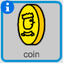

## جمع العملات الذهبية

أثناء تحرك كائن `اللاعب` في اللعبة، يمكنه أن يجمع عملات ذهبية.

+ أضف متغيرًا جديدًا يُسمى `العملات الذهبية`{:class="blockdata"} إلى مشروعك.

+ انقر بزر الماوس الأيمن فوق الكائن `عملة ذهبية` واختر **إظهار**.



+ أضف تعليمة برمجية إلى الكائن `عملة ذهبية` بحيث لا يظهر إلّا في الغرفة 1.

+ أضف تعليمة برمجية إلى الكائن `عملة ذهبية` بحيث يُضاف `1` إلى المتغير `العملات الذهبية`{:class="blockdata"} عندما يلمس كائنُ `اللاعب` الكائنَ `عملة ذهبية` لكي 'يلتقطه'.

	```blocks
		عند نقر ⚑
    انتظر حتى <ملامس لـ [player v] ؟>
    غيِّر [coins v] بمقدار (1)
    أوقف [المقاطع الأخرى في الكائن v]
    اختف
	```

	يجب استخدام التعليمة البرمجية `أوقف النصوص الأخرى في الكائن`{:class="blockcontrol"} بحيث يختفي الكائن `عملة ذهبية` من الغرفة 1 بمجرد جمعه.

+ ستحتاج أيضًا إلى إضافة تعليمة برمجية لتعيين المتغير `العملات الذهبية`{:class="blockdata"} إلى `0` في بداية اللعبة.

+ اختبر مشروعك — ويجب أن يؤدي جمع عملة ذهبية إلى تغيير نتيجة `العملات الذهبية` إلى `1`.

--- challenge ---
### التحدي: المزيد من العملات
هل يمكنك إضافة عملات ذهبية أخرى إلى اللعبة؟ يمكن أن تكون هذه العملات في غرف مختلفة، بل ويُمكن أن يحرس الأعداء القائمون بدوريات الحراسة بعض هذه العملات!

--- /challenge ---
