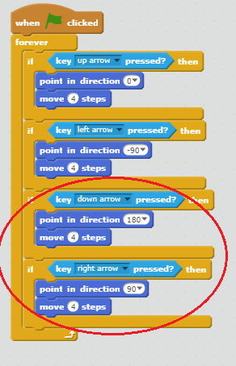

## تحريك كائن `اللاعب`

لنبدأ بإنشاء كائن `اللاعب` الذي يمكن أن يتحرك في كل مكان في اللعبة.

+ إذا كنتَ تستخدم برنامج Scratch عبر الإنترنت، فافتح مشروع 'أنشئ عالمك الخاص' لبرنامج Scratch على [http://jumpto.cc/world-go](http://jumpto.cc/world-go){:target="_blank"}. وإذا كنتَ تستخدم برنامج Scratch دون اتصال بالإنترنت، فنزِّل المشروع [من هنا](http://jumpto.cc/world-get){:target="_blank"}, ثم افتحه باستخدام المحرر الموجود على جهازك.  


سيستخدم الشخص الذي يلعب اللعبة مفاتيح الأسهم لتحريك كائن `اللاعب` في كل مكان. فعندما يضغط الشخص على مفتاح (سهم إلى أعلى)، ستأمر كائن `اللاعب` بالتحرك إلى أعلى، وهكذا مع مفاتيح الأسهم الأخرى بحيث يتحرك الكائن في الاتجاه الصحيح.

+ أضف هذه التعليمة البرمجية إلى الكائن `اللاعب`:

```blocks
	عند نقر ⚑
  كرر باستمرار 
    إذا <مفتاح [السهم العلوي v] مضغوط؟> 
      اتجه نحو الاتجاه (0)
      تحرك (4) خطوة
    end
  end
```

+ اختبر كائن `اللاعب` بالنقر على العلم ثم الضغط مطوَّلًا على مفتاح (سهم إلى أعلى). هل يتحرك كائن `اللاعب` إلى أعلى؟

	

+ لتحريك كائن `اللاعب` إلى اليسار، يجب إضافة قالب `if`{:class="blockcontrol"} آخر إليه بالتعليمة البرمجية نفسها:

```blocks
	عند نقر ⚑
  كرر باستمرار 
    إذا <مفتاح [السهم العلوي v] مضغوط؟> 
      اتجه نحو الاتجاه (0)
      تحرك (4) خطوة
    end
    إذا <مفتاح [السهم الأيسر v] مضغوط؟> 
      اتجه نحو الاتجاه (-90)
      تحرك (4) خطوة
    end
  end
```

+ أضف تعليمات برمجية أخرى إلى كائن `اللاعب` بحيث يتحرك إلى أسفل وإلى اليمين أيضًا. واستخدم التعليمة البرمجية التي لديك بالفعل لمساعدتك.

--- hints ---
--- hint ---
للتحريك إلى أعلى، وجَّهتَ كائن `اللاعب` في الاتجاه `0` درجة. ما الذي ستفعله لتحريك الكائن إلى أسفل؟

للتحريك إلى اليسار، وجَّهتَ كائن `اللاعب` في الاتجاه `90-` درجة. ما الذي ستفعله لتحريك الكائن إلى اليمين؟
--- /hint ---
--- hint ---
ستحتاج إلى تغيير هاتين الكتلتَين البرمجيتَين:
```blocks
<مفتاح [v] مضغوط؟>
```
```blocks
اتجه نحو الاتجاه ()
```

كرِّر التعليمة البرمجية التي استخدمتَها للتحريك إلى أعلى، لكن غيِّر هاتين الكتلتَين البرمجيتَين لتجعل كائن `اللاعب` يتحرك إلى أسفل. وافعل الشيء نفسه لتحريك الكائن إلى اليمين.
--- /hint ---
--- hint ---
يجب أن تكون التعليمة البرمجية التي تُدخلها كما يلي:


--- /hint ---
--- /hints ---
