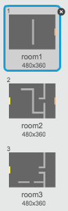
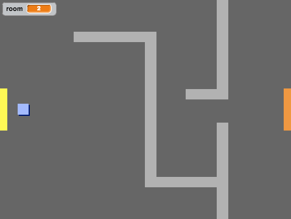

## برمجة عالمك

لنسمح لكائن `اللاعب` بالمرور إلى الغرف الأخرى عبر الأبواب.

يحتوي مشروعك على خلفيات لغرف إضافية:



+ أنشئ متغيرًا جديدًا 'لكل الكائنات' يُسمى `الغرفة`{:class="blockdata"} لتتبُّع الغرفة التي يكون كائن `اللاعب` موجودًا فيها.

[[[generic-scratch-add-variable]]]


+ عندما يلمس كائن `اللاعب` الباب البرتقالي في الغرفة الأولى، يجب أن تظهر الخلفية التالية، ويجب أن يتحرك كائن`اللعبة` إلى الخلف ناحية الجانب الأيسر من المنصة. أضف هذه التعليمة البرمجية داخل حلقة `كرِّر باستمرار` {:class="blockcontrol"} الخاصة بكائن `اللاعب`:

```blocks
	إذا <ملامس للون [#F2A24A] ؟> 
  غيّر الخلفية إلى [next backdrop v]
  اذهب إلى الموضع س: (-200) ص: (0)
  غيِّر [room v] بمقدار (1)
  end
```

+ أضف هذه التعليمة البرمجية إلى **بداية** التعليمة البرمجية لكائن `اللاعب` (أعلى حلقة `كرِّر باستمرار`{:class="blockcontrol"}) لتضمن عودة كل شيء إلى الحالة الأولى عند النقر على العلم:

	```blocks
		اجعل [room v] مساوياً (1)
    اذهب إلى الموضع س: (-200) ص: (0)
    غيّر الخلفية إلى [room1 v]
	```

+ انقر على العلم وحرِّك كائن `اللاعب` ليمر عبر الباب البرتقالي. هل يتحرك الكائن إلى الشاشة التالية؟ هل يتغير متغير `الغرفة`{:class="blockdata"} إلى `2`؟



--- challenge ---
### التحدي: التحريك إلى الغرفة السابقة

+ هل يمكنك أن تجعل كائن `اللاعب` يتحرك إلى الغرفة السابقة عندما يلمس بابًا أصفر؟ إن التعليمة البرمجية التي تحتاج إليها لتفعل ذلك تماثل التعليمة البرمجية التي أضفتَها بالفعل للتحريك إلى الغرفة التالية.

--- /challenge ---
