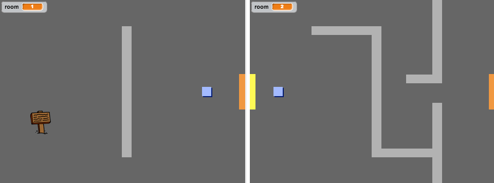

## اللافتات

لنُضِف لافتات إلى لعبتك لتوجيه اللاعب على مدار اللعبة.

+ يحتوي مشروعك على كائن `لافتة الترحيب`:


+ يجب أن يظهر كائن `لافتة الترحيب` في الغرفة 1 فقط، لذا أضف بعض التعليمات البرمجية إلى كائن `لافتة الترحيب` لتضمن حدوث ذلك:

```blocks
	عند نقر ⚑
  كرر باستمرار 
    إذا <(room) = [1]> 
      اظهر

      اختف
    end
  end
```

+ اختبر كائن `لافتة الترحيب` بتحريك اللاعب بين الغرف. يجب أن تظهر اللافتة في الغرفة 1 فقط.

	

+ لا تكون اللافتة ميزة في اللعبة إذا لم تُظهر أي رسالة! أضف بعض التعليمات البرمجية الأخرى لعرض رسالةٍ إذا كان الكائن `لافتة الترحيب` يلامس كائن `اللاعب`:

```blocks
	عند نقر ⚑
  كرر باستمرار 
    إذا <(room) = [1]> 
      اظهر

      اختف
    end
    إذا <ملامس لـ [player v] ؟> 
      قل [Welcome! Can you get to the treasure?]

      قل []
    end
  end
```

+ اختبر كائن `لافتة الترحيب` — سترى الآن رسالة تظهر عندما يلامس كائن `اللاعب` لافتة الترحيب.


