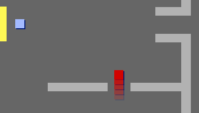

--- challenge ---
## التحدي: إضافة عدو

يمكنك أيضًا إضافة أعداء يقومون بدوريات حراسة. وإذا لمس اللاعب عدوًا، فستنتهي اللعبة.

+ أضف تعليمة برمجية إلى الكائن `عدو` بحيث لا يظهر إلّا في الغرفة 2.

+ أضف تعليمة برمجية لتحريك الكائن `عدو`، ولتنتهي اللعبة إذا لمس الكائنُ `عدو` الكائنَ `اللاعب`. يسهُل فعل ذلك في كتل تعليمات برمجية منفصلة. يجب أن تكون التعليمة البرمجية للكائن `عدو` كما يلي:

+ اختبر الكائن `عدو` لتتأكد من:
	+ أنه لا يظهر إلا في الغرفة 2
	+ أنه يحرس الغرفة
	+ أن اللعبة تنتهي إذا لمسه كائن `اللاعب`

--- /challenge ---

--- challenge ---
## التحدي: زيادة عدد الأعداء
هل يمكنك إنشاء كائن `عدو` آخر في الغرفة 3 يتحرك إلى أعلى وإلى أسفل لحراسة الفتحة الموجودة في الحائط؟

--- /challenge ---
