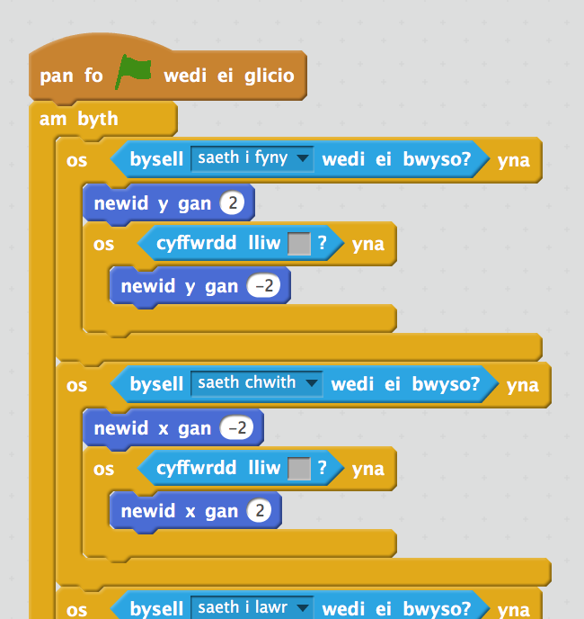

## Codio dy chwareuwr

Fe awn ati i greu chwareuwr sydd yn symud o gwmpas dy fydysawd.

+ Agora prosiect Scratch 'Creu dy Fydysawd' arlein yma <a href="http://jumpto.cc/world-go" target="_blank">jumpto.cc/world-go</a> neu lawrlwytha yma <a href="http://jumpto.cc/world-get" target="_blank">jumpto.cc/world-get</a> yna ei agor i'w ddefnyddio ar dy gyfrifiadur.

	

+ Fe ddefnyddiwn ni y bysellau saeth i symud y chwareuwr o gwmpas. Pan mae'r chwareuwr yn gwasgu'r saeth i fyny, rwyt ti eisiau i'r chwareuwr symud fyny trwy newid cyfeirnod 'y'. Ychwanega'r côd yma i giplun y chwareuwr ('player'):

	```blocks
		pan fo ⚑ wedi ei glicio
			am byth
   			os <bysell [saeth i fyny v] wedi ei wasgu?> wedyn
      	newid y gan (2)
   			end
		end

	```

+ Profa dy chwareuwr trwy glicio ar y faner ac yna dal y saeth fyny. Ydy dy chwareuwr yn symud fyny?

	

+ I symud dy chwareuwr i'r chwith, rwyt ti angen ychwaneg bloc `os`{:class="blockcontrol"} arall i dy chwareuwr sydd yn newid cyfeirnod x:

	```blocks
		pan fo ⚑ wedi ei glicio
			am byth
   				os <bysell [saeth i fyny v] wedi ei wasgu?> wedyn
      		newid y gan (2)
   		end
   				os <bysell [saeth chwith v] wedi ei wasgu?> wedyn
      		newid x gan (-2)
   			end
		end
	```

--- challenge ---

## Her: Symud i bedwar cyfeiriad
Alli di ychwanegu mwy o gôd i dy chwareuwr fel ei fod yn symud fyny, lawr, chwith a dde. Defnyddia'r côd sydd gen ti yn barod i dy helpu!

+ Profa dy chwareuwr eto, ac fe weli di fod ganddo'r gallu i gerdded trwy'r wal llwyd.

	

+ I ddatrys hyn, bydd angen i ti symud y chwareuwr ond yna ei symud yn ôl os yw'n cyffwrdd y wal llwyd. Dyma'r côd sydd angen arno ti:

	```blocks
		pan fo ⚑ wedi ei glicio
		am byth
   			os <bysell [saeth i fyny v] wedi ei wasgu?> wedyn
      			newid y gan (2)
      		os <cyffwrdd lliw [#BABABA]?> wedyn
         		newid y gan (-2)
      			end
   			end
		end
	```

	Sylwa fod y bloc newydd `os`{:class="blockcontrol"}`cyffwrdd lliw`{:class="blocksensing"} _tu fewn_ y bloc `os`{:class="blockcontrol"}`bysell [saeth i fyny]`{:class="blocksensing"}.

+ Profa'r côd newydd yma trwy symud o dan y wal - ni ddyle ti allu symud drosto.

	

+ Fe wnawn ni'r un peth i'r saeth chwith, gan symud yn ôl os yw'r chwareuwr yn cyffwrdd y wal. Dyma sut ddylai côd dy chwareuwr edrych:

	
	
--- /challenge ---

--- challenge ---
	
## Her: Datrys symudiad dy chwareuwr 
Ychwanega gôd i dy chwareuwr fel nad wyt ti'n gallu cerdded trwy waliau mewn unrhyw gyfeiriad. Defnyddia'r côd sydd gen ti yn barod i dy helpu!

--- /challenge ---
