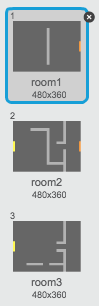
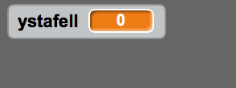

## Codio dy fydysawd

Fe wnawn ni adael i'r chwareuwr gerdded trwy ddrysau i ystafelloedd eraill!

+ Mae dy brosiect yn cynnwys cefndiroedd ar gyfer ystafelloedd ychwanegol:

	

+ Byddi di angen newidyn newydd 'ar gyfer pob ciplun' o'r enw `ystafell`{:class="blockdata"}, i wybod pa ystafell mae'r chwareuwr ynddo.

	

+ Pan mae'r chwareuwr yn cyffwrdd y drws oren yn yr ystafell gyntaf, fe ddylai'r cefndir nesaf ymddangos ac fe ddylai'r chwareuwr symud yn ôl i ochr chwith y llwyfan. Dyma'r côd fydd ei angen arno ti - fe ddylai gael ei osod tu fewn dolen `am byth`{:class="blockcontrol"} y chwareuwr.

	```blocks
		os <cyffwrdd lliw [#F2A24A]?> wedyn
   			newid cefndir i [cefndir nesaf v]
   			mynd i x:(-200) y:(0)
   			newid [room v] gan (1)
		end
	```

+ Ychwanega'r côd yma i _ddechrau_ côd dy chwareuwr (cyn y ddolen `am byth`{:class="blockcontrol"}) i sicrhau bod popeth yn ailgychwyn wrth glicio'r faner:

	```blocks
		gosod [room v] i (1)
		mynd i x:(-200) y:(0)
		newid cefndir i [r oom1v]
	```

+ Clicia'r faner a symud dy chwareuwr dros y drws oren. Ydy dy chwareuwr yn symud i'r sgrin nesaf? Ydy'r newidyn `ystafell`{:class="blockdata"} yn newid i 2?

	

--- challenge ---
	
## Her: Symud i'r ystafell flaenorol 
Wyt ti'n gallu gwneud i dy chwareuwr symud i'r ystafell flaenorol pan mae'n cyffwrdd drws melyn?  Cofia bydd y côd yma yn debyg _iawn_ i'r côd rwyt ti wedi ychwanegu yn barod i symud i'r ystafell nesaf.

--- /challenge ---
