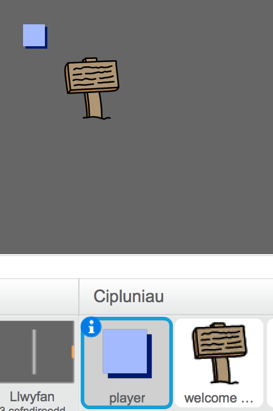

## Arwyddion

Fe awn ati i ychwanegu arwyddion i dy fydysawd, i fod o gymorth i'r chwareuwr ar y daith.

+ Mae dy brosiect yn cynnwys ciplun arwydd croeso:

	

+ Bydd yr arwydd yma ond yn weledol yn ystafell 1, felly fe wnawn ni ychwanegu côd i'r arwydd i sicrhau fod hyn yn digwydd:

	```blocks
		pan fo ⚑ wedi ei glicio
			am byth
   			os <(ystafell) = [1]> wedyn
      	dangos
   			fel arall
      	cuddio
   		end
		end
	```

+ Profa dy arwydd trwy symud rhwng yr ystafelloedd. Fe ddylai dy arwydd ond fod yn weledol yn ystafell 1.

	

+ Dyw'r arwydd ddim yn llawer o gymorth os nad yw e'n dweud unrhywbeth! Fe awn ati i ychwanegu mwy o gôd (mewn bloc arwahân) i arddangos neges os yw'r arwydd yn cyffwrdd y chwareuwr:

	```blocks
		pan fo ⚑ wedi ei glicio
			am byth
   				os <cyffwrdd [player v]?> wedyn
      		dweud [Welcome! Can you get to the treasure?]
   			fel arall
      		dweud []
   			end
		end
	```

+ Profa dy arwydd ac fe ddylai neges ymddangos pan mae'r chwareuwr yn ei gyffwrdd.

	

--- challenge ---

## Her: Trysor! 
Gwna clic-dde ar giplun y gist drysor a dewis 'dangos'.

Wyt ti'n gallu gwneud i dy gist drysor ymddangos ond yn ystafell 3 a dweud 'Da iawn!' pan mae'r chwareuwr yn ei gyffwrdd?


--- /challenge ---
