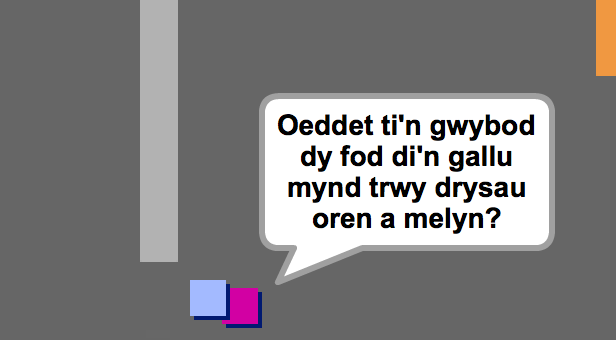
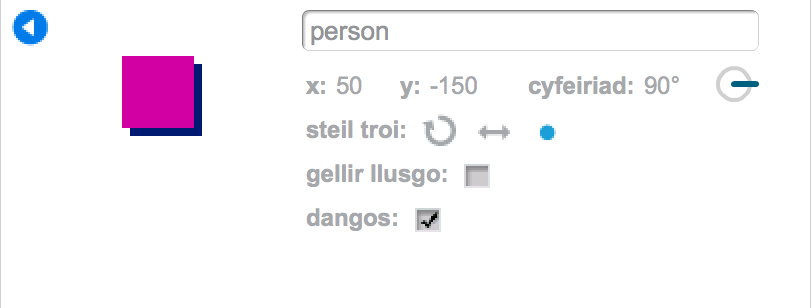
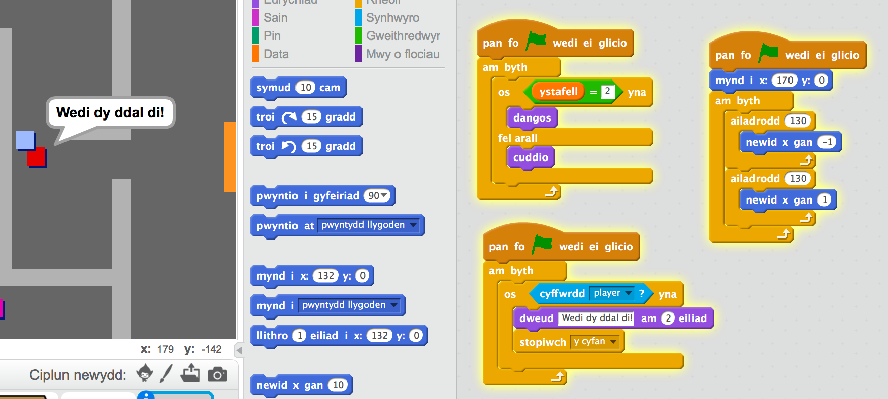

## Pobl

Fe awn ati i ychwanegu pobl arall i dy fyd.

+ Ychwanega'r côd yma i giplun y person, fel bod y person yn siarad gyda'r chwareuwr. Mae'r côd yma yn debyg iawn i'r côd wnes di ychwanegu i dy arwydd:

	```blocks
		pan fo ⚑ wedi ei glicio
			mynd i x:(0) y:(-150)
				am byth
   			os <cyffwrdd [player v]?> wedyn
      			dweud [Did you know that you can go through orange and yellow doors?]
   			fel arall
      			dweud []
   			end
		end
	```

+ Mae modd i ti hefyd adael i dy berson symud gan ddefnyddio'r ddau floc yma:

	```blocks
		symud (1) cam
		os ar ymyl, bowndio
	```

	Bydd dy berson yn bihafio yn wahanol yn dibynnu os wyt ti'n gosod y côd yma o fewn y ddolen `am byth`{:class="blockcontrol"} neu o fewn y bloc `os`{:class="blockcontrol"}. Tria'r ddau a gweld pa un rwyt ti'n hoffi orau.

	

+ Wyt ti wedi sylwi bod dy berson yn troi ben i waered? I stopio hyn, clicia eicon gwybdoaeth y ciplun (`i`{:class="blockmotion"}), a clicia'r dot i ddatrys steil y cylchdroi.

	

--- challenge ---

	
## Her: Gwella dy berson
Wyt ti'n gallu ychwanegu côd i dy berson newydd fel ei fod ond yn ymddangos yn ystafell 1? Gwna'n siwr dy fod di'n profi dy gôd newydd!

+ Fe alli di hefyd ychwanegu gelynion sydd yn dod â'r gêm i ben os yw'r chwareuwr yn eu cyffwrdd.  Ychwanega ciplun gelyn, a newida steil y cylchdroi, yn union fel wnes di gyda'r ciplun 'person'.

+ Ychwanega côd i dy elyn fel ei fod ond yn ymddangos yn ystafell 2.

+ Fe fyddi di hefyd angen ychwanegu côd i symud dy elyn, ac i ddod â'r gêm i ben os yw'r gelyn yn cyffwrdd y chwareuwr. Mae'n haws i wneud hyn mewn bloc o gôd arwahân. Dyma sut ddylai côd dy elyn edrych:

	

+ Profa dy elyn, i sicrhau:
	+ Ei fod ond yn ymddangos yn ystafell 2;
	+ Ei fod yn symud yn yr ystafell;
	+ Fod y gêm yn dod i ben os yw'r chwareuwr yn ei gyffwrdd.
	
--- /challenge ---

--- challenge ---

## Her: Mwy o elynion
Wyt ti'n gallu creu gelyn arall yn ystafell 3, sydd yn symud fyny a lawr trwy'r gap yn y wal?


--- /challenge ---
