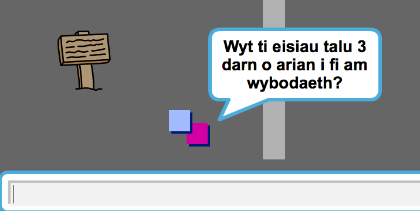
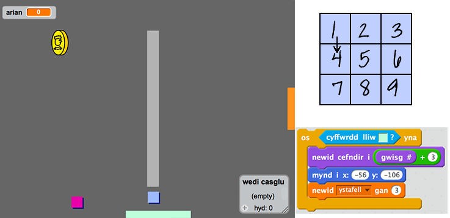

## Drysau ac allweddi

+ Golyga gwisg ciplun dy allwedd fel ei fod yn las. Gwna clic-dde ar giplun yr allwedd a dewis 'dangos' fel ei fod yn ymddangos ar y llwyfan. Newid y llwyfan i gefndir 3, a gosod yr allwedd rhywle anodd i gyrraedd!

 	

+ Gwna'n siwr fod dy allwedd ond yn ymddangos yn ystafell 3.

+ Bydd angen creu rhestr newidyn newydd o'r enw `wedi casglu`{:class="blockdata"}. Dyma lle fyddi di'n cadw'r holl eitemau bydd dy chwareuwr yn eu casglu.

+ Mae'r côd ar gyfer casglu'r allwedd yn debyg iawn i'r côd ar gyfer casglu'r darnau arian. Y gwahaniaeth yw fod yr allwedd yn dy restr o bethau wedi eu casglu.

	```blocks
		pan fo ⚑ wedi ei glicio
		aros hyd at <cyffwrdd [player v]?>
		ychwanegu [blue key] i [inventory v]
		stopiwch [sgriptiau eraill yn y ciplun v]
		cuddio
	```

+ Profa dy allwedd i weld os wyt ti'n gallu ei gasglu a'i ychwanegu i dy restr. Cofia ychwanegu côd i dy lwyfan i wagio dy restr o bethau wedi eu casglu ar ddechrau'r gêm.

	```blocks
		dileu (y cyfan v) o [wedi casglu v]
	```

+ Gosod dy giplun drws glas ar draws y gap yn y ddau wal.

	

+ Ychwanega gôd i dy ddrws, fel ei fod ond yn ymddangos yn ystafell 3.

+ Fe fyddi di angen cuddio dy ddrws glas i adael i dy chwareuwr i fynd heibio unwaith mae wedi casglu yr allwedd glas.

	```blocks
		pan fo ⚑ wedi ei glicio
		aros hyd at <[inventory v] yn cynnwys [blue key]>
		stopiwch [sgriptiau eraill yn y ciplun v]
		cuddio
	```

+ Profa dy brosiect a gweld os alli di gasglu'r allwedd las i agor y drws!


--- challenge ---

## Her: Creu dy fydysawd 
Alli di nawr barhau i greu dy fyd dy hunan. Dyma rai syniadau:

+ Newid gosodiadau'r gêm, a graffeg y gêm;
+ Ychwanegu sain a cherddoriaeth i dy gêm;
+ Ychwanegu mwy o bobl, gelynion, arwyddion a darnau arian;
+ Ychwanegu drysau coch a melyn, sydd angen eu allweddi eu hunan i'w agor nhw;
+ Ychwanegu mwy o ystafelloedd i dy fyd;
+ Ychwanegu mwy o eitemau defnyddiol i dy gêm;

+ Defnyddio darnau arian i gael gwybodaeth gan bobl arall;

	

+ Fe alli di hyd yn oed ychwanegu drysau gogledd a de, fel bod y chwareuwr yn symud rhwng ystafelloedd mewn 4 cyfeirad. Er enghraifft, os oes gen ti 9 ystafell, fe alli di feddwl amdanynt mewn grid 3x3. Fe alli di wedyn ychwanegu 3 i rif yr ystafell i symud lawr 1 lefel.

	

--- /challenge ---
