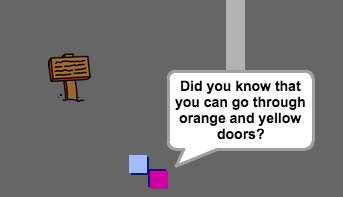

## Leute

Lass uns weitere Leute zu deiner Welt hinzufügen zu denen dein Spieler Umgang hat.

+ Füge diesen Code zum Personen-Sprite hinzu, sodass diese Person mit deinem Spieler spricht. Dieser Code ist sehr ähnlich zu dem Code, den du bereits zu deinem Schild hinzugefügt hast:

	```blocks
		Wenn die grüne Flagge angeklickt
		gehe zu x:(0) y:(-150)
		wiederhole fortlaufend
   			falls <wird [player v] berührt?> dann
      			sage [Wusstest du, dass du durch orange-farbene und gelb-farbene Türen gehen kannst?]
   			sonst
      			sage []
   			Ende
		Ende
	```

+ Du könntest deiner Person auch erlauben, sich zu bewegen, indem du diese beiden Blöcke benutzt:

	```blocks
		gehe (1) er-Schritt
		pralle vom Rand ab
	```

	Deine Person wird anders handeln, je nachdem, ob du diesen Code in der `forever`{:class="blockcontrol"} (für immer)Schleife oder in dem `if`{:class="blockcontrol"} (wenn) Block platzierst. Probier beides mal aus, um zu sehen, welches davon dir besser gefällt.

	

+ Hast du bemerkt, dass deine Person sich kopfüber dreht? Um dies zu stoppen, klicke auf das Informationssymbol (`i`{:class="blockmotion"}) des Sprites und klicke auf den Punkt, um den Drehungsstil zu reparieren.

	

--- challenge ---
	
## Aufgabe: Verbessere deine Person
Kannst du weiteren Code zu deiner neuen Person hinzufügen, sodass sie nur in Zimmer 1 erscheint? Achte darauf, dass du deinen neuen Code testest!

+ Du kannst auch ein paar patroullierende Feinde hinzufügen, die das Spiel automatisch beenden, wenn der Spieler sie berührt. Füge ein neues Feind-Sprite hinzu und ändere den Drehungsstil, genau so, wie du es mit dem 'person' Sprite getan hast.

+ Füge den Code zu deinem Feind hinzu, damit er nur in Zimmer 2 erscheint.

+ Du wirst auch Code hinzufügen müssen, um den Feind bewegen zu können und um das Spiel zu beenden, wenn der Feind den Spieler berührt. Es ist leichter, dies in separaten Code-Blöcken zu tun. Hier ist, wie dein Feind-Code aussehen sollte:

	

+ Teste deinen Feind, um sicher zu stellen, dass:
	+ er nur in Zimmer 2 sichtbar ist;
	+ er das Zimmer patroulliert;
	+ das Spiel endet, wenn der Spieler berührt wurde.
	
--- /challenge ---

--- challenge ---

## Aufgabe: Noch mehr Feinde 
Kannst du einen weiteren Feind in Zimmer 3 hinzufügen, der durch die Spalte in der Wand auf- und ab marschiert?


--- /challenge ---