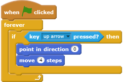
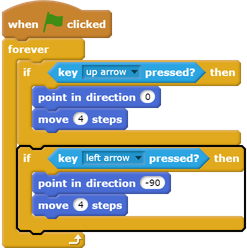
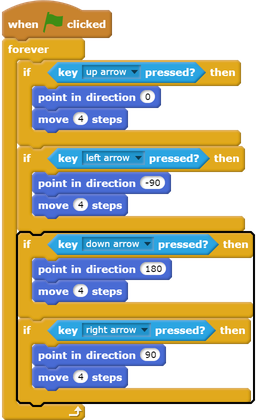

## Move the player sprite

Start by creating a `player` sprite that can move around your world. 

--- task ---

Open the 'Create your own world' Scratch starter project.

Download the starter project [rpf.io/p/en/create-your-own-world-scratch2-go](http://rpf.io/p/en/create-your-own-world-scratch2-go){:target="_blank"}, and then open it using the offline editor.
If you need to download and install the Scratch offline editor, you can find it at [rpf.io/scratchoff](https://rpf.io/scratchoff).

--- /task ---

Pressing the arrow keys should move the `player` sprite around. When the up arrow is pressed, the `player` sprite should move upwards on the Stage in response.

--- task ---

Add this code to the `player` sprite:

--- /task ---

--- task ---

Click the flag and then hold down the up arrow. Does the `player` sprite move up?

--- /task ---

--- task ---

To move the `player` sprite to the left, you need to add another `if`{:class="blockcontrol"} block with similar code:

--- /task ---

--- task ---

Add more code to your `player` sprite so it can move down and to the right as well. Use the code you already have to help you.

--- hints ---

--- hint ---

To move up, you point the `player` sprite in the direction `0` degrees. What do you have to do to move the sprite down?

To move left, you point the sprite in the direction `-90` degrees. What do you have to do to move the sprite right?

--- /hint ---

--- hint ---

You need to change these two blocks:

Duplicate the code that makes the `player` sprite move upwards, and change these two blocks to make the sprite move down. Duplicate the code again, and change it to make the sprite move to the right.

--- /hint ---
--- hint ---
Here is how your code should look:

--- /hint ---
--- /hints ---

--- /task ---
