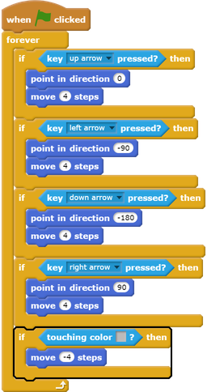

## Solid walls

--- task ---
Test your `player` sprite again. Do you see that it can walk through the light grey walls.

--- /task ---

--- task ---
To fix this, you need to make the `player` sprite move back if it touches a light grey wall. Here's the code you need to add inside your `forever`{:class="blockcontrol"} block below the direction blocks:

--- /task ---

--- task ---

Try to make the `player` sprite move through a wall. If your new code works, this shouldn't be possible.

--- /task ---
