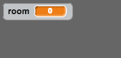
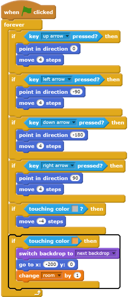
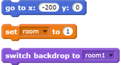
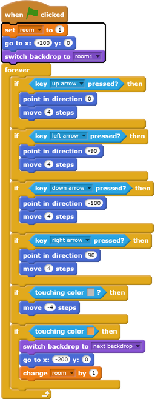

## Move around your world

The `player` sprite should be able to walk through doors into other rooms.

Your project contains backdrops for additional rooms:

--- task ---

Create a new 'for all sprites' variable called `room`{:class="blockdata"} to keep track of which room the `player` sprite is in.

[[[generic-scratch-add-variable]]]

--- /task ---

--- task ---
When the `player` sprite touches the orange door in the first room, the game should display the next backdrop, and the `player` sprite should move back to the left side of the Stage. Add this code inside the `player` sprite's `forever`{:class="blockcontrol"} loop:

--- /task ---

--- task ---
Every time the game starts, the room, character position, and backdrop need to be reset.

Add code to the **start** of your `player` sprite code above the `forever`{:class="blockcontrol"} loop, to reset everything when the flag is clicked:

--- hints --- --- hint ---
When the game starts:
+ The value of `room`{:class="blockdata"} should be set to `1`{:class="blockdata"}
+ The `backdrop`{:class="blocklooks"} should be set to `room1`{:class="blocklooks"}
+ The position of the `player` sprite should be set to `x: -200 y: 0`{:class="blockmotion"}
--- /hint --- --- hint ---
Here are the extra blocks you need:

--- /hint --- --- hint ---
Here's what your finished script should look like:

--- /hint --- --- /hints ---

--- /task ---

--- task ---
Click the flag, and then move your `player` sprite until it touches the orange door. Does the sprite move to the next screen? Does the `room`{:class="blockdata"} variable change to `2`?

--- /task ---

