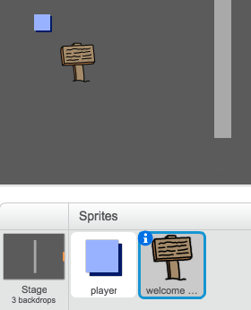
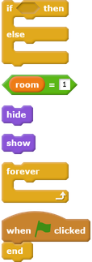
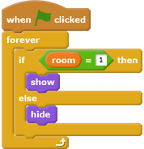
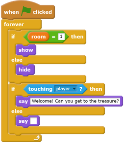

## Signs

Now add signs to your world to guide players on their journey.

Your project includes a `welcome sign` sprite:

--- task ---
The `welcome sign` sprite should only be visible in room 1, so add some code to the sprite to make sure that this happens:

--- hints --- --- hint ---
`When the flag is clicked`{:class="blockevents"}, in a `forever`{:class="blockcontrol"} loop, check `if`{:class="blockcontrol"} the `room is 1`{:class="blockdata"} and in that case `show`{:class="blocklooks"} `welcome sign` sprite, `else`{:class="blockcontrol"} `hide`{:class="blocklooks"} the sprite.
--- /hint --- --- hint ---
Here are the blocks you need:

--- /hint --- --- hint ---
Here is the complete code:

--- /hint --- --- /hints ---

--- /task ---

--- task ---
Test the code for your `welcome sign` sprite by moving between rooms. The sign should only be visible in room 1.

--- /task ---

--- task ---
A sign isn't much good if it doesn't say anything! Add some more code to display a message if the `welcome sign` sprite is touching the `player` sprite:

--- /task ---

--- task ---
Test your `welcome sign` sprite again. You should now see a message when the `player` sprite touches the `welcome sign` sprite.

--- /task ---
