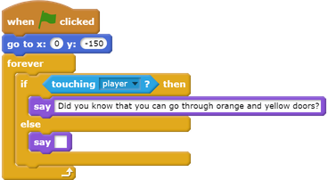
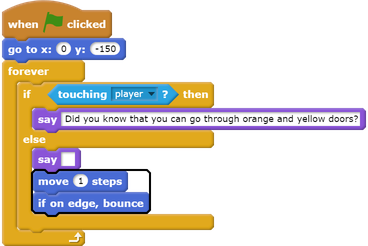

## People

Add other people to your world who your `player` sprite can interact with.

--- task ---
Switch to the `person` sprite.

--- /task ---

--- task ---
Add some code to the `person` sprite so that the person talks to the `player` sprite. This code is very similar to the code you added to your `sign` sprite:

--- /task ---

--- task ---
Allow your `person` sprite to move by adding these two blocks in the `else`{:class="blockcontrol"} section of your code:

--- /task ---

Your `person` sprite will now move, but will stop to talk to the `player` sprite.

--- task ---
Add code to your new `person` sprite so that the sprite only appears in room 1. The code you need is exactly the same as the code that makes the `sign` sprite only visible in room 1.

Make sure you test out your new code. 
--- /task ---
