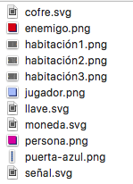
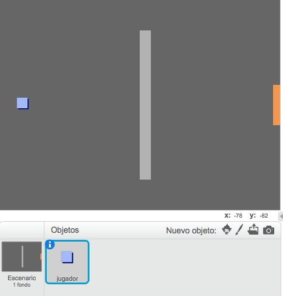
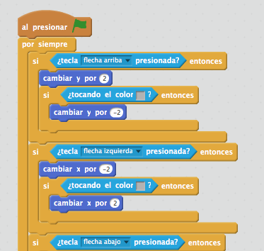

## Programar a tu jugador

Empezaremos creando un jugador que se pueda mover por tu mundo.

+ Crea un nuevo proyecto de Scratch, y borra el objeto gato para que el proyecto esté vacío. Puedes encontrar el editor online de Scratch aquí <a href="http://jumpto.cc/scratch-new">jumpto.cc/scratch-new</a>.

+ Para este proyecto, deberías de tener una carpeta llamada 'Recursos del Proyecto', que contiene todas las imágenes que necesitas. Asegúrate de tener esta carpeta, y pregunta al líder del Club si no la encuentras.

	

+ Carga la imagen 'habitación1.png' como fondo nuevo, y la imagen 'jugador.png' como nuevo objeto. Si no tienes estas imágenes, ¡puedes dibujarlas tú! Tu proyecto debería de parecerse a éste:

	

+ Usaremos las teclas de flecha para mover al jugador. Al presionar la flecha hacia arriba, queremos que el jugador se mueva hacia arriba, cambiando la coordenada y. Añade este código al objeto jugador:

	```blocks
		al presionar bandera verde
		por siempre
   			si <¿tecla [flecha arriba v] presionada?> entonces
      			cambiar y por (2)
   			fin
		fin
	```

+ Haz una prueba haciendo clic en la bandera verde, y a continuación presionando la flecha hacia arriba. ¿Se mueve tu jugador hacia arriba?

	

+ Para mover al jugador hacia la izquierda, necesitarás añadir otro bloque `si`{:class:"blockcontrol"}, que cambie la coordenada x:

	```blocks
		al presionar bandera verde
		por siempre
   			si <¿tecla [flecha arriba v] presionada?> entonces
      			cambiar y por (2)
   			fin
   			si <¿tecla [flecha izquierda v] presionada?> entonces
      			cambiar x por (-2)
   			fin
		fin
	```

## Reto: Moverse en las cuatro direcciones 
¿Puedes añadir más código a tu jugador, para que se pueda mover hacia arriba, abajo, derecha e izquierda? ¡Usa el código que ya tienes como ayuda!

+ Haz otra prueba con tu jugador, y verás que puede atravesar las paredes de color gris claro.

	

+ Para arreglar esto, tienes que hacer que el jugador se mueva, pero que rebote si toca una pared de color gris claro. Necesitarás este código:

	```blocks
		al presionar bandera verde
		por siempre
   			si <¿tecla [flecha arriba v] presionada?> entonces
      			cambiar y por (2)
      			si <¿tocando el color [#BABABA]?> entonces
         			cambiar y por (-2)
      			fin
   			fin
		fin
	```

	Fíjate que el nuevo bloque `si`{:class:"blockcontrol"}`tocando el color`{:class:"blocksensing"} está _dentro_ del bloque `si`{:class:"blockcontrol"}`tecla [flecha arriba]`{:class:"blocksensing"}.

+ Prueba este nuevo código pasando por debajo de la pared - no deberías de poder atravesarla si te mueves hacia arriba.

	

+ Vamos a hacer lo mismo para la flecha izquierda, haremos que rebote si el jugador toca una pared. Con todo lo que hemos añadido, el código de tu jugador se debería de parecer a éste:

	

## Reto: Arreglar el movimiento de tu jugador 
Añade código a tu jugador para que no pueda atravesar las paredes en ninguna dirección. ¡Usa el código que ya tienes como ayuda!
