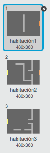
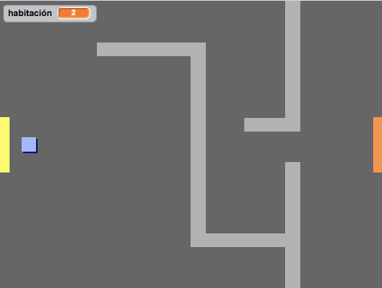

## Programar tu mundo

¡Vamos a hacer que el jugador pueda pasar por puertas hacia otras habitaciones!

+ Añade otros dos fondos a tu escenario ('habitación2.png' y 'habitación3.png'), para que tengas 3 fondos en total. Asegúrate de que estén en el orden correcto - esto te ayudará más tarde.

	

+ Necesitarás una nueva variable con el nombre `habitación`{:class:"blockdata"}, que te indicará en qué habitación se encuentra el jugador.

	

+ Cuando el jugador toque la puerta naranja en la primera habitación, tendría que aparecer el siguiente fondo, y el jugador debería de aparecer en el lado izquierdo de la pantalla. Éste es el código que necesitas - debería de estar dentro del bucle `por siempre`{:class:"blockcontrol"} de tu jugador:

	```blocks
		si <¿tocando el color [#F2A24A]?> entonces
   			cambiar fondo a [siguiente fondo v]
   			ir a x:(-200) y:(0)
   			cambiar [habitación v] por (1)
		fin
	```

+ Añade las siguientes líneas al _principio_ del código del jugador (antes del bucle `por siempre`{:class:"blockcontrol"}) para que todo se reinicie cuando hagas clic en la bandera:

	```blocks
		fijar [habitación v] a (1)
		ir a x:(-200) y:(0)
		cambiar fondo a [habitación1 v]
	```

+ Haz clic en la bandera y mueve al jugador por encima de la puerta naranja. ¿Se mueve el jugador hasta la siguiente pantalla? ¿Cambia el número de la variable `habitación`{:class:"blockdata"} a 2?

	

## Reto: Volver a la habitación anterior 
¿Puedes hacer que el jugador vuelva a la habitación anterior cuando toque una puerta amarilla? Recuerda que este código será _muy_ parecido al que ya has añadido para que avance a la siguiente habitación.
