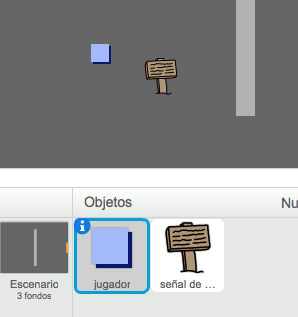
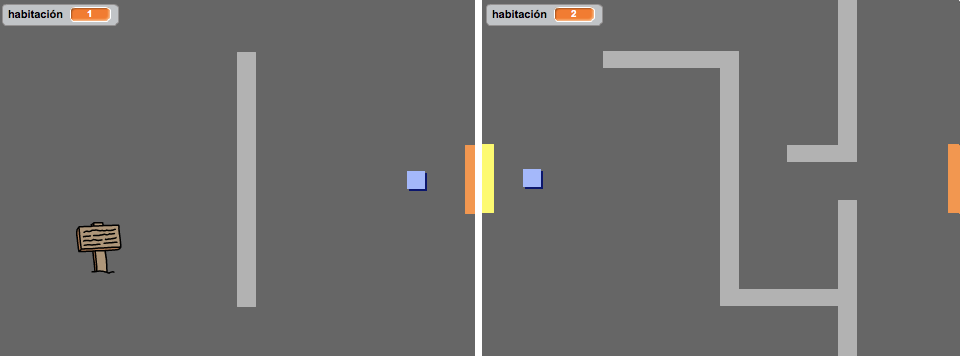
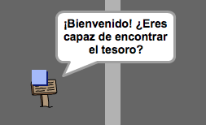
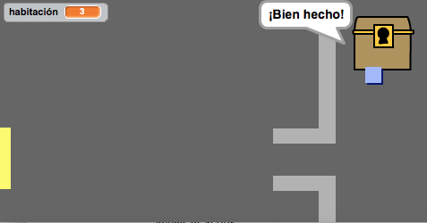

## Señales

Ahora añadiremos señales a tu mundo, para guiar al jugador en su viaje.

+ Carga la imagen 'señal.svg' como un nuevo objeto, y cámbiale el nombre a 'señal de bienvenida'.

	

+ Esta señal sólo tiene que verse en la habitación 1, así que vamos a añadir código a la señal para asegurarnos de que sea así:

	```blocks
		al presionar bandera verde
		por siempre
   			si <(habitación) = [1]> entonces
      			mostrar
   			si no
      			esconder
   			fin
		fin
	```

+ Prueba la señal moviéndote entre habitaciones. La señal sólo debería de verse en la habitación 1.

	

+ ¡Una señal no nos sirve de mucho si no tiene nada escrito! Vamos a añadir más código (en un bloque aparte) para que la señal nos muestre un mensaje si el jugador la toca:

	```blocks
		al presionar bandera verde
		por siempre
   			si <¿tocando [jugador v]?> entonces
      			decir [¡Bienvenido! ¿Eres capaz de encontrar el tesoro?]
   			si no
      			decir []
   			fin
		fin
	```
+ Prueba la señal. Tendrías que ver un mensaje cuando el jugador la toca.

	

## Reto: ¡Tesoro! 
¿Puedes añadir un nuevo objeto de un cofre del tesoro, con la imagen 'cofre.svg'?. El cofre del tesoro debería de aparecer en la habitación 3, y debería decir '¡Bien hecho!' cuando el jugador lo toque.


