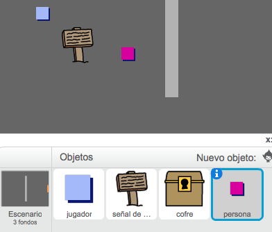
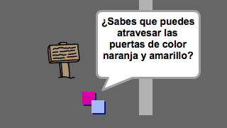
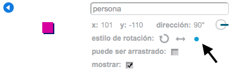
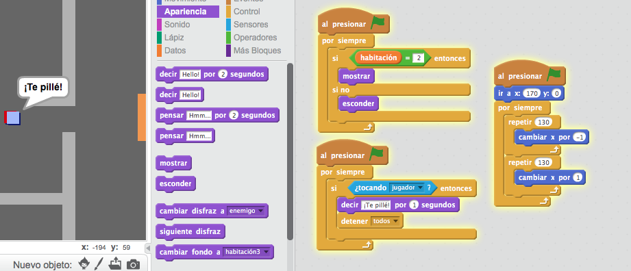
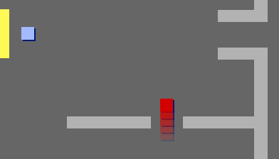

## Personas 

Vamos a añadir a otras personas a tu mundo con las que tu jugador pueda interactuar.

+ Añade un nuevo objeto de persona, utilizando la imagen 'persona.png'.

	

+ Añade este código para que la persona hable con tu jugador. Este código es muy parecido al que has añadido a la señal:

	```blocks
		al presionar bandera verde
		ir a x:(-200) y:(0)
		por siempre
   			si <¿tocando [jugador v]?> entonces
      			decir [¿Sabes que puedes atravesar las puertas de color naranja y amarillo?]
   			si no
      			decir []
   			fin
		fin
	```

+ También puedes hacer que la persona se mueva, si usas estos dos bloques:

	```blocks
		mover (1) pasos
		rebotar si toca un borde
	```

	La persona se comportará diferente dependiendo de si añades este código dentro del bucle `para siempre`{:class="blockcontrol"} o en el bloque `si`{:class="blockcontrol"}. Prueba los dos y decide cuál prefieres.

	

+ ¿Te has dado cuenta de que la persona se da la vuelta cuando rebota? Para que deje de hacer esto, presiona el icono de información del objeto (`i`{:class="blockmotion"}), y haz clic en el punto para fijar el estilo de rotación.

	

## Reto: Mejorar el objeto persona 
¿Puedes añadir código a tu nueva persona, para que sólo aparezca en la habitación 1? ¡Recuerda probar el nuevo código!

+ Vamos a añadir unos guardias enemigos, con los que se acaba el juego si el jugador los toca. Añade un nuevo objeto de enemigo, y cambia su estilo de rotación, igual que has hecho antes con el objeto 'persona'.

+ Añade código a tu enemigo para que sólo aparezca en la habitación 2.

+ También necesitarás añadir código para que el enemigo se mueva, y para que el juego termine si el enemigo toca al jugador. Será más fácil si lo haces en bloques de código separados. El código debería de parecerse a éste:

	

+ Prueba a tu enemigo, para asegurarte de que:
	+ Sólo es visible en la habitación 2;
	+ Patrulla la habitación;
	+ El juego termina si el jugador lo toca.

## Reto: Más enemigos 
¿Puedes crear otro enemigo en la habitación 3, que patrulle en sentido vertical a través del agujero en la pared?


