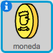

## Recoger monedas

+ Añade una nueva variable llamada `monedas`{:class:"blockdata"} al proyecto.

+ Añade un nuevo objeto 'moneda' al proyecto.



+ Añade código a la moneda para que sólo aparezca en la habitación 1.

+ Añade código al objeto moneda, para que se sume 1 a tus `monedas`{:class:"blockdata"} cuando la recojas:

	```blocks
		al presionar bandera verde
		esperar hasta que <¿tocando [jugador v]?>
		cambiar [monedas v] por (1)
		detener [otros programas en el objeto v]
		esconder
	```

	Usamos el código `detener otros programas en el objeto`{:class:"blockcontrol"} para que la moneda desaparezca de la habitación 1 cuando el jugador la recoja.

+ Necesitarás añadir código para que la variable `monedas`{:class:"blockdata"} vuelva a 0 al principio del juego.

+ Prueba el proyecto - al recoger las monedas, tu puntuación debería de cambiar a 1.

## Reto: Más monedas
¿Puedes añadir más monedas al juego? Podrían estar en diferentes habitaciones, e incluso algunas de las monedas podrían estar vigiladas por guardias enemigos.
