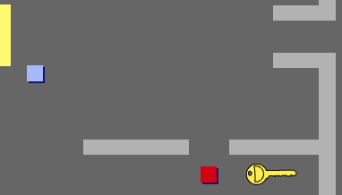
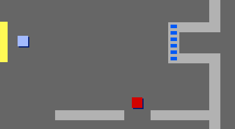
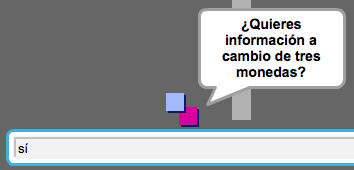
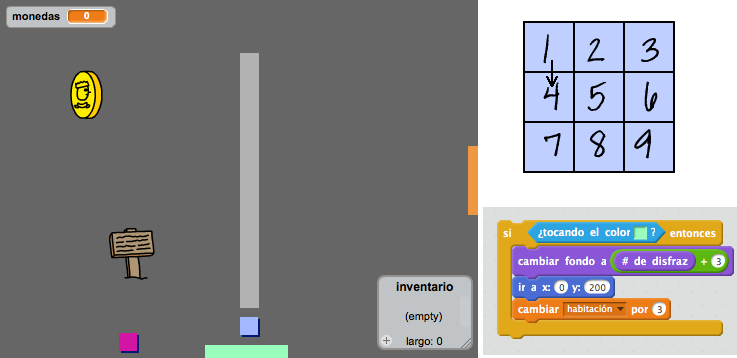

## Puertas y llaves 

+ Crea un nuevo objeto con la imagen 'llave.svg'. Ve al escenario 3, ¡y coloca la llave en algún sitio al que sea difícil llegar!

 	

+ Asegúrate de que sólo se ve la llave en la habitación 3.

+ Crea una lista nueva llamada `inventario`{:class:"blockdata"}. En el inventario se guardarán todos los objetos que el jugador recoja.

+ El código para recoger la llave es muy parecido al código usado para recoger monedas. La diferencia es que tienes que añadir la llave al inventario.

	```blocks
		al presionar bandera verde
		esperar hasta que <¿tocando [jugador v]?>
		añade [llave] a [inventario v]
		detener [otros programas en el objeto v]
		esconder
	```

+ Prueba el código de la llave, para ver si la puedes recoger y se añade al inventario. Recuerda añadir código al escenario para vaciar el inventario al empezar el juego.

	```blocks
		borrar (todos v) de [inventario v]
	```

+ Crea un nuevo objeto con la imagen 'puerta-azul.png', y coloca la puerta azul tapando el agujero entre las dos paredes.

	

+ Añade código a la puerta, para que sólo aparezca en la habitación 3.

+ Tendrás que esconder la puerta para que el jugador pueda pasar si tiene la llave en el inventario.

	```blocks
		al presionar bandera verde
		esperar hasta que <[inventario v] contiene [llave]>
		detener [otros programas en el objeto v]
		esconder
	```

+ ¡Haz una prueba, para ver si puedes recoger la llave y abrir la puerta!

## Reto: Crea tu propio mundo
Ahora puedes continuar creando tu propio mundo. Aquí tienes algunas ideas:

+ Cambia el decorado y los gráficos de tu juego;
+ Añade sonidos y música al juego;
+ Añade más personas, enemigos, señales y monedas;
+ Añade puertas rojas y amarillas, que necesiten sus propias llaves para abrirse;
+ Añade más habitaciones a tu mundo;
+ Añade al juego otros objetos útiles;

+ Utiliza las monedas para conseguir información de otras personas;

	

+ Incluso podrías añadir puertas en la parte superior o inferior de la pantalla, para que el jugador se pueda mover entre habitaciones en las 4 direcciones. Por ejemplo, si tuvieras 9 habitaciones, podrías organizarlas como si estuvieran en una cuadrícula de 3x3. En ese caso, tendrías que sumar 3 al número de la habitación para bajar un nivel.

	
