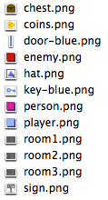
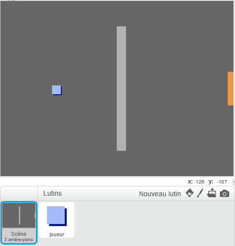
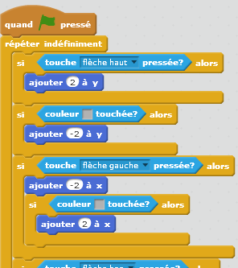

## Coder votre joueur 

Commençons par créer un personnage qui pourra se déplacer dans votre monde. 

+ Commencez un nouveau project de Scratch et supprimez le lutin de chat pour que votre projet soit vide. Vous pouvez trouver l'éditeur scratch en ligne à  <a href="http://jumpto.cc/scratch-new">jumpto.cc/scratch-new</a>.

+ Pour ce projet, vous devriez trouver un dossier "ressources projet" contenant toutes les images dont vous aurez besoin. Assurez-vous de bien l'avoir et contactez le leader de votre club si vous ne le trouvez pas.

	

+ Ajoutez l'image "Salle1.png" comme arrière-plan et utilisez l'image "Joueur1.png" comme photo. Si vous ne trouvez pas ces images, dessinez-les vous même! Votre projet devrait maintenant ressembler à ceci:

	

+ Utilisons les touches directionnelles pour faire bouger le joueur. Lorsque le joueur appuie sur le flèche du haut, le personnage doit monter. Cela se fait en changeant les coordonnées Y. Ajoutez ce code au joueur:

	```blocks
		quand le drapeau vert pressé
		répéter indéfiniment
 			si <touche [flèche haut v] pressée?> alors
      			ajouter (2) à y
  			fin
		fin
	```

+ Testez votre joueur en cliquant le drapeau et en maintenant la flèche du haut. Votre joueur monte-t-il?

	

+ Pour que votre joueur puisse bouger vers la gauche, vous devez ajouter un nouveau code `if`{:class="blockcontrol"}, ce qui modifiera la coordonnée X:

	```blocks
		quand le drapeau vert pressé
		répéter indéfiniment
 	  		si <touche [flèche haut v] pressée?> alors
      			ajouter (2) à y
   			fin
   			si <touche [flèche gauche v] pressée?> alors
      			ajouter (-2) à x
   			fin
		fin
	```

## Défi : Bouger dans toutes les directions
Pouvez-vous ajouter du codage supplémentaire à votre joueur pour qu'il puisse se déplacer vers le haut, le bas, la gauche et la droite? Utilisez le code que l'on vous a donné pour faciliter la tâche!


+ Testez votre joueur de nouveau et vous verrez qu'il aura la capacité de marcher à travers les murs gris clairs.
	

+ Pour remédier à ce problème, vous devez bouger le joueur et le faire revenir sur ses pas s'il touche un mur gris clair. Voici le code qui vous permettra d'y parvenir :

	```blocks
		quand le drapeau vert pressé
		répéter indéfiniment
   			si <touche [flèche haut v] pressée?> alors
     			ajouter (2) à y
      			si <couleur [#BABABA] touchée?> alors
         			ajouter (-2) à y
      			fin
   			fin
		fin
	```

	Remarquez que le nouveau code `if`{:class="blockcontrol"}`touching color`{:class="blocksensing"} est situé dans le code `if`{:class="blockcontrol"}`key [up arrow]`{:class="blocksensing"}

+ Testez ce nouveau code en deplaçant votre joueur vers le mur - vous ne devriez plus pouvoir le traverser.

	

+ Faisons la même chose pour la commande de flèche gauche en reculant si le joueur touche un mur. Le code de votre joueur devrait ressembler à ceci :

	

## Défi : Régler les mouvements de votre joueur 
Ajoutez du codage à votre joueur pour qu'il ne puisse plus marcher à travers les murs dans chaque direction. Utilisez le code que vous avez déjà pour faciliter la tâche!
