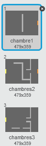
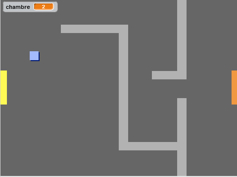

## Coder votre monde

Faisons en sorte que votre joueur puisse passer à travers les portes et dans d'autres salles!

+ Ajoutez 2 arrière-plans à votre monde ('room2.png' et 'room3.png'), vous devriez avoir 3 arrière-plans au total. Assurez-vous qu'ils sont dans le bon ordre - sinon, cela compliquera les choses par la suite.

	

+ Il vous faut une nouvelle variable appellée `salle`{:class="blockdata"} afin de savoir dans quelle pièce votre joueur se trouvera.

	

+ Lorsque le joueur touche la porte orange dans la première pièce, le prochain arrière-plan devrait apparaître et le personnage devrait se retrouver sur le côté gauche de l'écran. Voici le code dont vous aurez besoin - celui-ci devrait se retrouver au sein de la boucle `forever`{:class="blockcontrol"} de ton joueur :

	```blocks
	si <couleur [#F2A24A] touchée?> alors
   	basculer sur l'arrière-plan [arrière-plan suivant v]
   	aller à x:(-200) y:(0)
   	ajouter à [room v] (1)
	fin
	```

+ Ajoutez ce code au début du code de votre joueur (avant la boucle `forever`{:class="blockcontrol"}) pour vous assurer que tout soit remis a zéro lorsque le drapeau est cliqué.

	```blocks
	mettre [room v] à (1)
	aller à x:(-200) y:(0)
	basculer sur l'arrière-plan [room1 v]
	```

+ Cliquez sur le drapeau et positionnez votre joueur sur la porte orange. Votre personnage se déplace-t-il sur l'autre écran? La variable `room`{:class="blockdata"} change-t-elle à 2?

	

## Défi : Vous déplacer dans la pièce précédente
Pouvez-vous déplacer votre joueur dans la pièce précédente lorsqu'il touche la porte jaune? Rappellez-vous que ce code sera _très_ similaire à celui que vous avez déjà ajouté pour le faire déplacer dans la pièce suivante.
