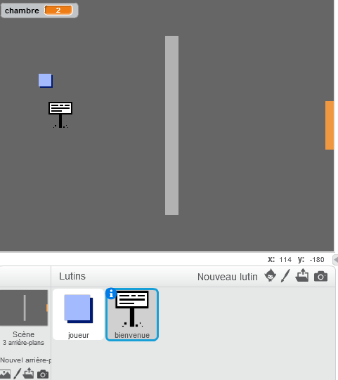
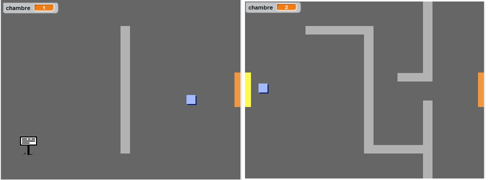
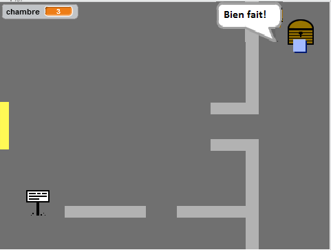

## Signalisations

Ajoutons des panneaux à votre monde pour guider votre joueur dans son voyage.

+ Téléchargez l'image 'sign.svg' en temps que nouveau "lutin" et renommez la 'Panneau de Bienvenue'

	
+ Ce panneau devrait uniquement être visible dans la première salle, alors ajoutons donc quelques lignes de code pour s'en assurer:

	```blocks
		quand le drapeau vert pressé
		répéter indéfiniment
   			si <(room) = [1]> alors
      			montrer
   			sinon
      			cacher
  			fin
		fin
	```

+ Testez votre panneau en vous déplaçant entre les salles. Le panneau ne devrait être visible que dans la première salle.

	

+ Un panneau n'est pas très utile s'il n'y a rien d'écrit dessus! Ajoutons quelques lignes de code (dans un block différent) pour afficher un message lorsque la panneau touche au joueur.

	```blocks
		quand le drapeau vert pressé
		répéter indéfiniment
   			si <[player v] touché?> alors
      			dire [Bienvenue ! Peux tu trouver le trésor ?]
   			sinon
      			dire []
   			fin
		fin
	```

+ Testez votre panneau, vous devriez voir le message lorsque votre joueur le touche.

	

## Défi : Trésor ! 
Faites un clic droit sur le lutin de coffre à trésor et choissez 'show'. Pouvez-vous faire apparaître un coffre à trésor uniquement dans la salle 3 et avoir un message qui affiche 'Bravo !' lorsque le joueur le touche?


