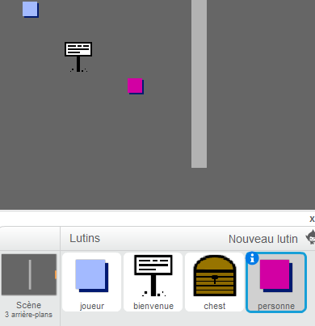
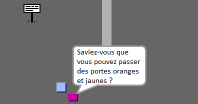
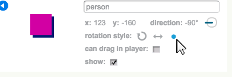
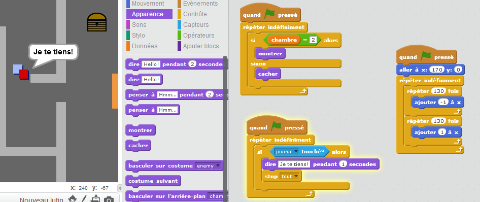

## Les gens

Ajoutons d'autres lutins à votre monde pour que votre joueur puisse interagir avec eux.

+ Ajoutez un nouveau lutin en utilisant l'image 'person.png'.

	

+ Ajoutez ce code pour que le lutin puisse parler à votre joueur. Ce code est très similaire à celui que vous avez écrit pour votre panneau :

	```blocks
		quand le drapeau vert pressé
		aller à x:(200) y:(0)
		répéter indéfiniment
   			si <[player v] touché?> alors
      			dire [Savais-tu que tu peux traverser les portes jaunes et organges ?]
  			sinon
      			dire []
   			fin
		fin
	```

+ Vous pouvez également permettre à ce lutin de bouger en utilisant ces deux blocs :

	```blocks
		avancer de (1)
		rebondir si le bord est atteint
	```

	Le lutin se déplacera d'une façon différente selon l'endroit où vous placerez votre code : au sein de la boucle`forever`{:class="blockcontrol"} ou dans le bloc `if`{:class="blockcontrol"} . Essayez les deux et choisissez celui que vous préférez.

	

+ Avez-vous remarqué que le lutin marche sur la tête ? Pour empêcher cela, cliquez sur l'icône d'information du lutin (`i`{:class="blockmotion"}) et cliquez sur le point pour régler les paramètres de rotation.

	

## Défi : Améliorer votre lutin
Pouvez-vous ajouter du codage à votre nouveau personnage pour qu'il n'apparaisse que dans la première salle ? Attention : n'oubliez pas de tester votre nouveau code !

+ Vous pouvez également ajouter des ennemis qui feront la patrouille dans votre monde. Lorsque votre joueur les touchera, la partie se terminera. Ajoutez un ennemi et changez les paramètres de rotation, comme vous l'avez déjà fait pour le lutin.

+ Ajoutez les lignes de code à votre ennemi pour qu'il n'apparaisse que dans la deuxième salle.

+ Il ne reste qu'à ajouter le code pour terminer la partie si le joueur touche a l'ennemi. Cela sera plus facile à faire dans des blocs de code séparés. Le code de votre ennemi doit ressembler à cela :

	

+ Testez votre ennemi et assurez-vous:
	+ Qu'il ne soit visible que dans la deuxième salle
	+ Qu'il effectue la patrouille dans la salle
	+ Que la partie se termine si le joueur le touche

## Défi : Plus d'ennemis 
Pouvez-vous créer un ennemi dans la salle 3 qui fait la patrouille du haut en bas en passant par l'ouverture dans le mur ?


