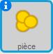

## Collecter des pièces

+ Ajoutez une nouvelle variable appelée `pièce`{:class="blockdata"} à votre projet.

+ Faites un clic droit sur le lutin de piece et sélectionnez 'show'



+ Ajoutez du codage à votre pièce pour qu'elle n'apparaisse que dans la première salle.

+ Ajoutez du codage à votre 'lutin' de pièce pour ajouter '1' a votre nombre de pièces dès que la pièce a été collectée :

	```blocks
		quand le drapeau vert pressé
		attendre jusqu’à <[player v] touché?>
		ajouter à [coins v] (1)
		stop [autres scripts du lutin v]
		cacher
	```

	Le code `stop other scripts in sprite`{:class="blockcontrol"} est nécessaire pour que la pièce n'apparaisse plus dans la première salle lorsqu'elle a été collectée.

+ Il vous faut maintenant quelques lignes de code pour que le nombre de `pièces`{:class="blockdata"} soit à 0 au début du jeu.

+ Testez votre projet - Ammasser des pièces devrait changer votre score à 1.

## Défi : Plus de pièces
Pouvez-vous ajouter plus de pièces dans votre jeu ? Elles peuvent se trouver dans des salles différentes et certaines pièces peuvent même être gardées par des des ennemis qui font la patrouille !
