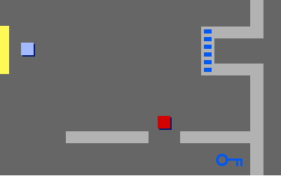
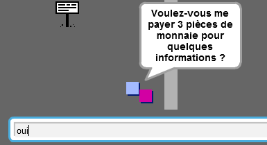
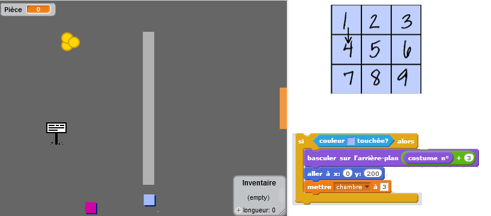

## Portes et clés

+ Créez un nouveau lutin à partir de l'image 'Clé Bleue.svg'. Positionnez-vous dans votre arrière plan 3 et placez la clé quelque part difficile d'accès !

 	

+ Assurez-vous que la clé ne soit visible que dans la troisième salle.

+ Créez une nouvelle liste variable appelée `inventaire`{:class="blockdata"}. C'est ici que vous pouvez stocker tous les objets que votre joueur collectera durant la partie.

+ Le code pour collecter la clé est très similaire à celui pour collecter les pièces. La différence est que vous devez ajouter la clé à votre inventaire.

	```blocks
		quand le drapeau vert pressé
		attendre jusqu’à <[player v] touché?>
		ajouter [blue key] à [inventory v]
		stop [autres scripts du lutin v]
		cacher
	```

+ Testez votre clé, essayez de la collecter et de l'ajouter dans votre inventaire. N'oubliez pas d'ajouter le code pour vider votre inventaire au début de la partie.  

	```blocks
	supprimer l'élément (tout v) de la liste [inventaire v]
	```

+ Créez un nouveau lutin avec l'image 'porte bleue.png' et placez la porte bleue dans un des trous sur les murs.

	

+ Ajoutez du codage à votre porte pour qu'elle ne soit visible que dans la troisième salle.

+ Il faut que la porte bleue disparaisse pour que votre joueur puisse passer lorsque vous avez la clé bleue dans votre inventaire.

	```blocks
		quand le drapeau vert pressé
		attendre jusqu’à <[inventory v] contient [clef bleue]>
		stop [autres scripts du lutin v]
		cacher
	```

+ Testez votre projet et regardez si vous pouvez collecter la clé bleue afin d'ouvrir la porte!

## Défi : Créer votre propre monde 
Vous pouvez maintenant continuer de créer votre propre monde. Quelques idées :

+ Changez les paramètres de votre jeu et de vos images ;
+ Ajoutez des sons et de la musique à votre jeu ;
+ Ajoutez des gens, ennemis, panneaux et pièces ;
+ Ajoutez des portes jaunes et rouges, accompagnées de leurs propres clés ;
+ Ajoutez des pièces à votre monde ;
+ Ajoutez d'autres objects utiles ;
+ Utilisez des pièces afin obtenir des informations des autres joueurs ;

	

+ Vous pourriez même ajouter des portes vers le nord et le sud pour que votre joueur puisse se déplacer dans toutes les directions. Par exemple, si vous aviez 3 salles, vous pourriez les positionner comme une grille 3x3. Vous pourriez ensuite ajouter 3 au numéro de la salle pour descendre d'un niveau.

	
