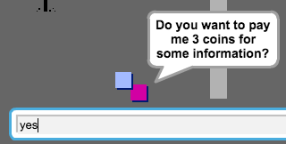

--- challenge ---
## चुनौती: अपनी दुनिया को बढ़ाएं
आप अब अपनी खुद की दुनिया बनाना जारी रख सकते हैं! कुछ विचार इस प्रकार हैं:

+ अपने गेम की सेटिंग बदलें, अपने गेम के ग्राफिक बदलें
+ अपने गेम में ध्वनि और संगीत जोड़ें
+ और लोग, दुश्मन, संकेत, और कॉइन जोड़ें
+ लाल और पीले दरवाज़े, और उन्हें खोलने के लिए विशेष कुंजियाँ जोड़ें
+ अपनी दुनिया में और कक्ष जोड़ें
+ अपने गेम में अन्य उपयोगी आइटम्स जोड़ें

+ अन्य लोगों से जानकारी प्राप्त करने के लिए कॉइन का उपयोग करें:

+ आप कक्ष 1 की उत्तरी और दक्षिणी दीवारों में दरवाज़े भी जोड़ सकते हैं, ताकि खिलाड़ी सभी चार दिशाओं में कक्षों में गति कर सके। उदाहरण के लिए, यदि आप के नौ कक्ष हैं, तो आप उन्हें 3×3 ग्रिड के रूप में सोच सकते हैं। फिर आप एक स्तर नीचे जाने के लिए कक्ष संख्या में `3` जोड़ सकते हैं।

--- /challenge ---
