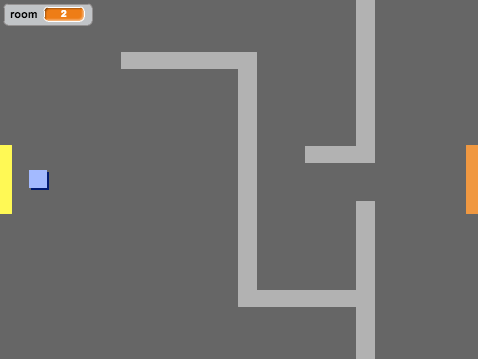

## अपनी दुनिया को कोड करना

चलिए `प्लेयर` स्प्राइट को दरवाज़ों से अन्य कक्षों में से गुजरने की इजाज़त दें।

आपके प्रोजेक्ट में अतिरिक कक्षों के लिए बैकड्रॉप्स शामिल हैं:


+ यह ध्यान रखने के लिए कि `प्लेयर` स्प्राइट किस कक्ष में है, `कमरा`{:class="blockdata"} नामक नया 'सभी स्प्राइट के लिए' वेरिएबल बनाएँ।

[[[generic-scratch-add-variable]]]


+ जब `प्लेयर` स्प्राइट पहले कक्ष में संतरी दरवाज़े को छूता है, तो अगला बैकड्रॉप दिखाई देना चाहिए, और `प्लेयर` स्प्राइट स्टेज के बाईं ओर आ जाना चाहिए। इस कोड को `प्लेयर` स्प्राइट के `हमेशा के लिए`{:class="blockcontrol"} लूप में जोड़ें:

```blocks
	अगर <[#F2A24A] रंग को छू रहा है?> हो तो
end
		पृष्ठभूमि बदल कर [अगली पृष्ठभूमि v] करें
		x:(-200) y:(0) पर जाएँ
		[कमरा v] से (1) बदले
	end
```

+ फ्लैग पर क्लिक करने पर सभी कुछ रीसेट होना सुनिश्चित करने के लिए, इस कोड को अपने `प्लेयर` स्प्राइट कोड (`हमेशा के लिए`{:class="blockcontrol"} लूप के ऊपर) के **प्रारंभ** में जोड़ें:

	```blocks
		[कमरा v] पर (1) सेट करे
		x:(-200) y:(0) पर जाएँ
		पृष्ठभूमि बदल कर [कमरा1 v] करें
	```

+ फ्लैग पर क्लिक करें और अपने `प्लेयर` स्प्राइट को संतरी दरवाज़े पर स्थानांतरित करें। क्या आपका स्प्राइट अगली स्क्रीन पर गति करता है? क्या `कमरा`{:class="blockdata"} वेरिएबल `2` में परिवर्तित होता है?



--- challenge ---
### चुनौती: पिछले कक्ष में जाना

+ क्या आप अपने `प्लेयर` स्प्राइट को पिछले कक्ष में स्थानांतरित कर सकते हैं, जब वे पीले दरवाज़े को छूते हैं? यह कोड उसी कोड के समान है, जो आपने अगले कक्ष में गति करने के लिए पहले ही जोड़ लिया है।

--- /challenge ---
