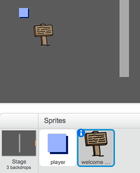

## संकेत

चलिए खिलाड़ी को उसकी यात्रा में मार्गदर्शन करने के लिए, आपकी दुनिया में संकेत जोड़ें।

+ आपके प्रोजेक्ट में `स्वागत चिह्न` स्प्राइट शामिल होती है:



+ `स्वागत चिह्न` स्प्राइट केवल कक्ष 1 में ही दिखाई देनी चाहिए, इसलिए ऐसा होना सुनिश्चित करने के लिए `स्वागत चिह्न` स्प्राइट में कुछ कोड जोड़ें:

```blocks
	जब ⚑ क्लिक किया गया हो
	हमेशा के लिए
end
		अगर <(कमरा) = [1]> हो तो
end
			दिखाएं
		या
			छुपाएँ
		end
	end
```

+ कक्षों में गति द्वारा अपने `स्वागत चिह्न` स्प्राइट का परीक्षण करें। आपका संकेत कक्ष 1 में ही दिखाई देना चाहिए।

	

+ यदि संकेत से कुछ पता नहीं चलता है, तो यह बहुत अच्छा नहीं होता! यदि `स्वागत चिह्न` स्प्राइट `प्लेयर` स्प्राइट को छूता है, तो संदेश दिखाने के लिए अन्य कोड जोड़ें:

```blocks
	जब ⚑ क्लिक किया गया हो
	हमेशा के लिए
end
		अगर <(कमरा) = [1]> हो तो
end
			दिखाएं
		या
			छुपाएँ
		end
        अगर <[प्लेयर v] को छू रहा है?> हो तो
end
            [स्वागतम! क्या आप खजाने तक पहुंच सकते हैं?] बोले
        या
            [] बोले
        end
	end
```

+ अपने `स्वागत चिह्न` स्प्राइट का परीक्षण करें — अब आप `प्लेयर` स्प्राइट को इससे छूनने पर संदेश दिखना चाहिए।


