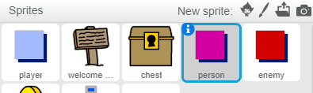

## लोग

चलिए आपकी दुनिया में अन्य लोग जोड़ें, जिनसे आपका `प्लेयर` स्प्राइट इंटरेक्ट कर सकता है।

+ `व्यक्ति` स्प्राइट पर स्विच करें।



+ `व्यक्ति` स्प्राइट में कुछ कोड जोड़ें, ताकि व्यक्ति `प्लेयर` स्प्राइट से बात करे। यह कोड उस कोड के बहुत समान है, जो आपने `sign` स्प्राइट में जोड़ा है:

```blocks
	जब ⚑ क्लिक किया गया हो
	x:(0) y:(-150) पर जाएँ
	हमेशा के लिए
end
		अगर <[प्लेयर v] को छू रहा है?> हो तो
end
			[क्या आप जानते हैं कि आप नारंगी और पीले दरवाज़े से जा सकते हैं?] बोले
		या
			[] बोले
		end
	end
```

+ आप अपने कोड के `या`{:class="blockcontrol"} अनुभाग में ये दो ब्लॉक जोड़कर अपने `व्यक्ति` स्प्राइट को गति करने की इजाज़त दे सकते हैं:

```blocks
(1) कदम चले
अगर किनारे पर है तो उछाले
```

अब आपका `व्यक्ति` स्प्राइट गति करगा, परन्तु `प्लेयर` स्प्राइट से बातचीत रोक देगा।


--- challenge ---
### चुनौती: व्यक्ति में सुधार करें
क्या आप अपने `व्यक्ति` स्प्राइट में कोड जोड़ सकते हैं, ताकि वे केवल कक्ष 1 में दिखाई दें? अपने नए कोड का परीक्षण करना सुनिश्चित करें।

--- /challenge ---
