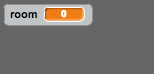

## Codifica il tuo mondo

Facciamo in modo che il giocatore possa entrare nelle altre stanze camminando attraverso i muri!

+ Il tuo progetto contiene scenari per stanze aggiuntive:

	

+ Avrai bisogno di una nuova variabile 'per tutti gli sprite' chiamata `stanza`{:class="blockdata"}, per tenere traccia della stanza in cui si trova il giocatore.

	

+ Quando il giocatore tocca la porta arancione nella prima stanza, verrà visualizzato il prossimo scenario, e il giocatore tornerà verso il lato sinistro del quadro. Ecco il codice che ti servirà - dovrebbe andare dentro il loop `forever`{:class="blockcontrol"} del giocatore:

	```blocks
		se <sta toccando il colore [#F2A24A]> allora
			passa allo sfondo [next backdrop v]
			vai a x: (-200) y: (0)
			cambia [room v] di (1)
		fine
	```

+ Aggiungi questo codice all'_inizio_ del codice del tuo giocatore (prima del loop `per sempre`{:class="blockcontrol"}) per assicurarti che venga tutto azzerato quando si clicca la bandiera:

	```blocks
		porta [room v] a (1)
		vai a x: (-200) y: (0)
		passa allo sfondo [room 1 v]
	```

+ Clicca la bandiera e sposta il tuo giocatore sulla porta arancione. Il tuo giocatore si muove verso la prossima schermata? La variabile `stanza`{:class="blockdata"} cambia a 2?

	

## Sfida: Spostarsi alla stanza precedente 
Puoi far muovere il giocatore verso la stanza precedente quando tocca una porta gialla? Ricordati che questo codice è_molto_simile a quello che hai già usato per muoverlo alla stanza seguente.
