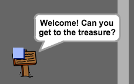

## Segnali

Aggiungiamo ora dei segnali al tuo mondo, che guideranno il giocatore nel suo viaggio.

+ Il tuo progetto include uno sprite di segnale di benvenuto:

	

+ Questo segnale sarà visibile solo nella stanza 1, dunque aggiungiamo un codice al segnale per assicurarci che ciò accada:

	```blocks
		quando si clicca sulla bandiera verde
		per sempre
			se < (stanza) = [1] > allora
				mostra
			altrimenti
				nascondi
			fine
		fine
	```

+ Prova il tuo segnale muovendoti tra le stanze. Il tuo segnale dovrebbe essere visibile solo nella stanza 1.

	

+ Un segnale non servirà a nulla se non c'è alcuna scritta! Aggiungiamo un altro codice (in un blocco separato) per visualizzare un messaggio nel caso in cui il messaggio stia toccando il giocatore:

	```blocks
		quando si clicca sulla bandiera verde
		per sempre
			se <sta toccando [player v]> allora
				dire [Benvenuto! Puoi raggiungere il tesoro?]
			altrimenti
				dire []
			fine
		fine
	```
+ Prova il tuo segnale e vedrai un messaggio quando il giocatore lo tocca.

	

## Sfida: Tesoro! 
Fai clic col pulsante destro sullo sprite del forziere e scegli 'mostra'.

Puoi fare apparire lo sprite del forziere solo nella stanza 3 e dire 'Ottimo lavoro!' quando il giocatore lo tocca?


