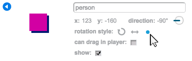

## Persone 

Aggiungiamo altre persone al tuo mondo con le quali il tuo giocatore può interagire.

+ Aggiungi questo codice allo sprite della persona, in modo che la persona parli con il tuo giocatore. Questo codice è molto simile a quello che hai aggiunto al segnale:

	```blocks
		quando si clicca sulla bandiera verde
		vai a x: (0) y: (-150)
		per sempre
			se <sta toccando [player v]> allora
				dire [Sapevi che puoi attraversare le porte arancione e gialla?]
			altrimenti
				dire []
			fine
		fine
	```

+ Puoi anche far muovere la tua persona usando qusti due blocchi:

	```blocks
		fai (1) passi
		rimbalza quando tocchi il bordo
	```

	La persona agirà diversamente, a seconda se posizioni questo codice dentro al loop `per sempre`{:class="blockcontrol"} o al blocco `se`{:class="blockcontrol"}. Provali entrambi e scegli quello che preferisci.

	

+ Hai notato che la tua persona si capovolge a testa in giù? Per fermarla, clicca il simbolo delle informazioni dello sprite (`i`{:class="blockmotion"}), e clicca sul punto per aggiustare lo stile di rotazione.

	

## Sfida: Migliora la tua persona 
Puoi aggiungere un codice alla tua nuova persona, in modo che appaia solo nella stanza 1? Ricordati di provare il tuo nuovo codice!

+ Puoi aggiungere anche nemici in perlustrazione, che terminano la partita se il giocatore li tocca. Aggiungi un nuovo sprite del nemico e cambia lo stile di rotazione, proprio come hai fatto con lo sprite della 'persona'.

+ Aggiungi un codice al tuo nemico, in modo che appaia solo nella stanza 2.

+ Dovrai anche aggiungere un codice per muovere il nemico, e per terminare il gioco se il nemico tocca il giocatore. Sarà più facile farlo in blocchi di codice separati. Il codice del tuo nemico dovrebbe essere così:

	

+ Prova il tuo nemico per assicurarti che:
	+ È visibile solo nella stanza 2;
	+ Pattuglia la stanza;
	+ Il gioco termina se il giocatore lo tocca.

## Sfida: Altri nemici 
Puoi creare un altro nemico nella stanza 3 che vada avanti e indietro attraverso le aperture nel muro?


