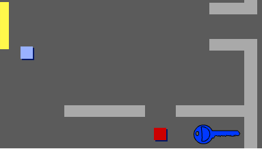

## Porte e chiavi

+ Modifica l'aspetto dello sprite chiave per farlo diventare blu. Clicca col pulsante destro lo sprite chiave e scegli 'mostra' per farlo apparire sul quadro. Cambia il tuo quadro allo scenario 3 e colloca la chiave in una posizione difficile da raggiungere!

 	

+ Assicurati che la chiave sia visibile solo nella stanza 3.

+ Crea una nuova variabile chiamata `inventario`{:class="blockdata"}. Lì verranno conservati tutti gli oggetti che il tuo giocatore raccoglie.

+ Il codice per raccogliere la chiave è molto simile a quello per raccogliere le monete. La differenza è che aggiungi la chiave al tuo inventario.

	```blocks
		quando si clicca sulla bandiera verde
		attendi fino a quando <sta toccando [player v]>
		aggiungi [chiave blu] a [inventario v]
		stop [altre scritte in sprite v]
		nascondi
	```

+ Prova la tua chiave per vedere se puoi prenderla, e aggiungila all'inventario. Ricordati di aggiungere il codice al tuo quadro per svuotare l'inventario all'inizio.

	```blocks
		cancella (tutto v) da [inventario v]
	```

+ Posiziona lo sprite della porta blu attraverso l'apertura tra i due muri.

	

+ Aggiungi un codice alla tua porta, in modo che appaia solo nella stanza 3.

+ Dovrai nascondere la tua porta blu per permettere al tuo giocatore di passare una volta che hai la chiave blu nell'inventario.

	```blocks
		quando si clicca sulla bandiera verde
		attendi fino a quando <[inventario v] contiene [chiave blu]>
		stop [altre scritte in sprite v]
		nascondi
	```

+ Prova il tuo progetto e vedi se puoi prendere la chiave blu per aprire la porta!

## Sfida: Crea il Tuo Mondo 
Ora puoi continuare a creare il tuo mondo. Ecco alcune idee:

+ Cambia le impostazioni e le grafiche del tuo gioco;
+ Aggiungi al tuo gioco musica ed effetti sonori;
+ Aggiungi altre persone, nemici, segnali e monete;
+ Aggiungi porte rosse e gialle, che avranno bisogno delle loro chiavi per essere aperte;
+ Aggiungi altre stanze al tuo mondo;
+ Aggiungi al tuo gioco altri oggetti utili;

+ Usa le monete per ottenere informazioni dalle altre persone;

	

+ Puoi perfino aggiungere porte a nord e a sud, così che il giocatore possa muoversi in tutte e 4 le direzioni. Per esempio, se avessi 9 stanze, potresti pensarle come una griglia 3x3. Puoi dunque aggiungere 3 al numero della stanza per scendere di 1 livello.

	
