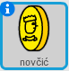

## Sakupljanje novčića

Dok se kreće po svijetu, tvoj lik `igrača` može da sakuplja novčiće.

+ Dodaj u svoj projekat novu promjenljivu pod nazivom `novčići`{:class="blockdata"}.

+ Klikni desnim tasterom miša na lik `novčića` i izaberi **show** (prikaži).



+ Dodaj kôd svom liku `novčića` tako da se pojavljuje samo u sobi 1.

+ Dodaj kôd liku `novčića` da napraviš da se vrijednost promjenljive `novčići`{:class="blockdata"} uveća za `1` kada lik `igrača` dodirne lik `novčića` da ga 'pokupi'.
    
    ```blocks
        when flag clicked
        wait until <touching [player v]?>
        change [novčići v] by (1)
        stop [other scripts in sprite v]
        hide
    ```
    
    Kôd `stop other scripts in sprite`{:class="blockcontrol"} (zaustavi ostale skripte lika) nam je potreban da napravimo da se lik `novčića` više ne prikazuje u sobi 1 kada ga igrač pokupi.

+ Treba da dodaš i kôd za postavljanje tvoje promjenljive `novčići`{:class="blockdata"} na `0` na početku igre.

+ Isprobaj svoj projekat — kada pokupiš novčić, broj tvojih `novčića` bi trebalo da se promijeni u `1`.

--- challenge ---

### Izazov: više novčića

Možeš li da dodaš još novčića u svoju igru? Oni mogu da budu u različitim sobama, a neke od njih bi čak mogli da čuvaju neprijatelji koji patroliraju!

--- /challenge ---