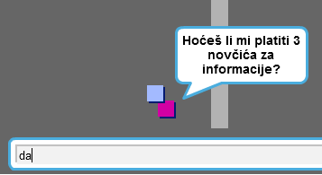
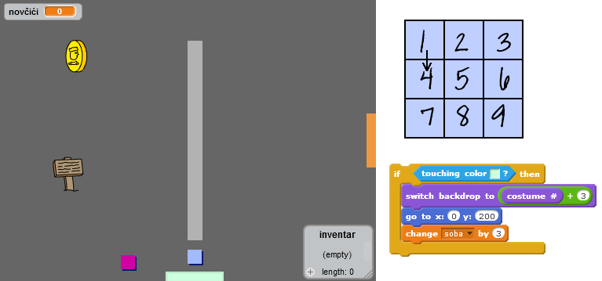

--- challenge ---

## Izazov: proširi svoj svijet

Sada možeš da nastaviš da kreiraš sopstveni svijet! Evo nekoliko ideja:

+ Izmijeni dekor i grafike svoje igre
+ Dodaj u svoju igru zvukove i muziku
+ Dodaj još osoba, neprijatelja, znakova i novčića
+ Dodaj crvena i žuta vrata, kao i posebne ključeve za njihovo otvaranje
+ Dodaj još soba u svoj svijet
+ Dodaj druge korisne stvari u svoju igru

+ Upotrijebi novčiće da dobiješ informacije od drugih osoba:

+ Možeš čak da dodaš vrata na sjeverni i južni zid sobe 1, kako bi igrač mogao da se kreće između soba u sva četiri pravca. Na primjer, ako imaš devet soba, možeš da ih rasporediš kao da se nalaze u rešetki 3x3. Zatim, za spuštanje na niži nivo, možeš broj sobe uvećati za `3`.

--- /challenge ---