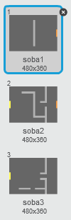
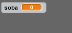
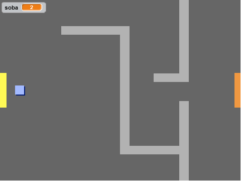

## Programiranje tvog svijeta

Omogućimo liku `igrača` da prolazi kroz vrata u druge sobe.

Tvoj projekat sadrži pozadine (backdrops) za dodatne sobe:



+ Kreiraj novu promjenljivu 'za sve likove' ('for all sprites' variable) pod nazivom `soba`{:class="blockdata"}, koja će ti pokazivati u kojoj sobi se lik `igrača` nalazi.

[[[generic-scratch-add-variable]]]



+ Kada lik `igrača` dodirne narandžasta vrata u prvoj sobi, treba da se prikaže sljedeća pozadina (next backdrop), a lik `igrača` treba da se vrati na lijevu stranu pozornice. Dodaj ovaj kôd unutar petlje `forever`{:class="blockcontrol"} (ponavljaj) lika `igrača`:

```blocks
    if < touching color [#F2A24A] > then
        switch backdrop to [next backdrop v]
        go to x: (-200) y: (0)
        change [soba v] by (1)
    end
```

+ Dodaj ovaj kôd na **početak** kôda lika `igrača` (prije petlje `forever`{:class="blockcontrol"}), kako bi se sve vratilo na početnu poziciju kada se klikne na zastavicu:
    
    ```blocks
        set [soba v] to (1)
        go to x: (-200) y: (0)
        switch backdrop to [soba1 v]
    ```

+ Klikni na zastavicu i pomjeraj svoj lik `igrača` preko narandžastih vrata. Da li tvoj lik prelazi na sljedeći ekran? Da li se vrijednost promjenljive `soba`{:class="blockdata"} mijenja na `2`?



--- challenge ---

### Izazov: vraćanje u prethodnu sobu

+ Da li možeš da napraviš da se tvoj lik `igrača` vrati u prethodnu sobu kada dodirne žuta vrata? Kôd koji ti je potreban je veoma sličan kôdu koji smo već dodali za prelazak u sljedeću sobu.

--- /challenge ---