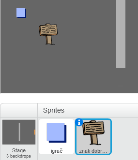
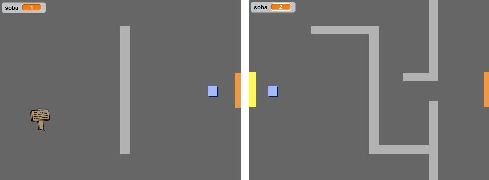
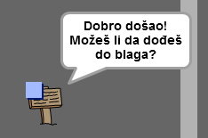

## Znakovi

Dodajmo u tvoj svijet znakove koji će voditi igrača na njegovom putovanju.

+ Tvoj projekat sadrži lik `znaka dobrodošlice`:



+ Lik `znaka dobrodošlice` treba da bude vidljiv samo u sobi1, pa zato dodaj kôd liku `znaka dobrodošlice` da to osiguraš:

```blocks
    when flag clicked
    forever
        if < (soba) = [1] > then
            show
        else
            hide
        end
    end
```

+ Isprobaj svoj lik `znaka dobrodošlice` krećući se između soba. Tvoj znak bi trebalo da bude vidljiv samo u sobi 1.
    
    

+ Znak nije koristan ako ništa ne govori! Dodaj kôd da se prikaže poruka kada lik `znaka dobrodošlice` dodirne lik `igrača`:

```blocks
    when flag clicked
    forever
        if < (soba) = [1] > then
            show
        else
            hide
        end
        if < touching [igrač v]? > then
            say [Dobro došao! Možeš li da dođeš do blaga?]
        else
            say []
        end
    end
```

+ Isprobaj lik `znaka dobrodošlice` — sada bi trebalo da vidiš poruku kada ga lik `igrača` dodirne.

