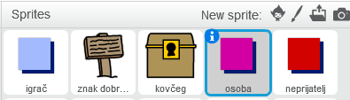
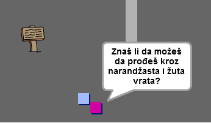

## Osobe

Dodajmo u tvoj svijet druge osobe sa kojima tvoj lik `igrača` može da komunicira.

+ Pređi na lik `osobe`.



+ Dodaj kôd liku `osobe` da napraviš da osoba razgovara sa likom `igrača`. Ovaj kôd je veoma sličan kôdu koji si dodao/dodala svom liku `znaka`:

```blocks
    when flag clicked
    go to x: (0) y: (-150)
    forever
        if < touching [igrač v]? > then
            say [Znaš li da možeš da prođeš kroz narandžasta i žuta vrata?]
        else
            say []
        end
    end
```

+ Takođe, možeš omogućiti liku `osobe` da se kreće tako što ćeš dodati ova dva bloka u dio `else`{:class="blockcontrol"} (inače) svog kôda:

```blocks
move (1) steps
if on edge, bounce
```

Tvoj lik `osobe` sada će se kretati, ali će prestati da razgovara sa likom `igrača`.



--- challenge ---

### Izazov: poboljšaj osobu

Da li možeš da dodaš kôd svom novom liku `osobe` tako da se pojavljuje samo u sobi 1? Ne zaboravi da isprobaš svoj novi kôd.

--- /challenge ---