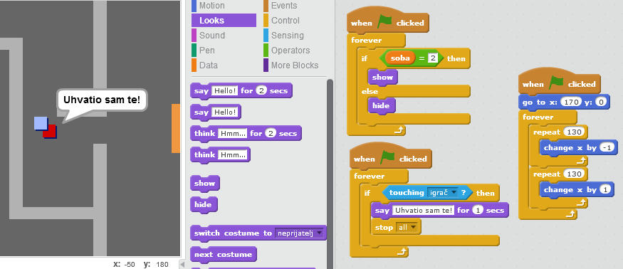

--- challenge ---

## Izazov: neprijatelji

Možeš da dodaš i neprijatelje koji patroliraju. Ako igrač dodirne neprijatelja, igra se završava.

+ Dodaj kôd liku `neprijatelja` tako da se pojavljuje samo u sobi 2.

+ Dodaj kôd da se lik `neprijatelja` kreće i da se igra završi ako lik `neprijatelja` dodirne lik `igrača`. Ovo je lakše uraditi u odvojenim blokovima kôda. Ovako bi mogao da izgleda kôd tvog lika `neprijatelja`:

+ Isprobaj svoj lik `neprijatelja` da se uvjeriš u sljedeće:
    + Da je vidljiv samo u sobi 2
    + Da patrolira po sobi
    + Da se igra završava ako ga lik `igrača` dodirne

--- /challenge ---

--- challenge ---

## Izazov: više neprijatelja

Da li možeš u sobi 3 da kreiraš još jedan lik `neprijatelja` koji patrolira gore-dolje kroz otvor u zidu?

--- /challenge ---