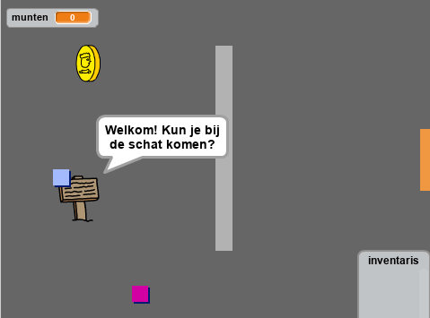

--- no-print ---

This is the **Scratch 2** version of the project. There is also a [Scratch 3 version of the project](https://projects.raspberrypi.org/nl-NL/projects/create-your-own-world).

--- /no-print ---

## Inleiding

In dit project leer je je eigen adventure-spel te maken waar de speler meerdere kamers gaat ontdekken.

### Wat je gaat maken

Klik op de groene vlag om te starten. Gebruik de pijltjestoetsen om je spelfiguur in de wereld rond te bewegen.

  <iframe allowtransparency="true" width="485" height="402" src="https://scratch.mit.edu/projects/embed/235588367/?autostart=false" frameborder="0"></iframe>
  

### Wat je gaat leren

Dit project behandelt elementen uit de volgende onderdelen van de[Raspberry Pi Digital Making Curriculum](http://rpf.io/curriculum){:target="_blank"}:

+ [Gebruik programmeerconstructies om om een probleem op te lossen.](https://www.raspberrypi.org/curriculum/programming/builder){:target="_blank"}

### Aanvullende informatie voor docenten

Als je dit project wilt afdrukken, gebruik dan de [printvriendelijke versie](https://projects.raspberrypi.org/nl-NL/projects/create-your-own-world-scratch2/print){:target="_blank"}.

Gebruik de link in de voettekst voor toegang tot de GitHub opslagplaats voor dit project, met daarin alle bronnen (inclusief een voorbeeld van een voltooid project) in de map `nl-NL/resources`.
