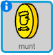

## Munten verzamelen

Terwijl de sprite `speler` door de wereld gaat kan die munten verzamelen.

+ Voeg een nieuwe variabele `munten`{:class="blockdata"} toe aan je project.

+ Klik rechts op de sprite `munt` en kies **verschijn**.



+ Voeg code toe aan de sprite `munt` zodat die alleen in kamer 1 verschijnt.

+ Voeg code toe aan de sprite `munt` zodat `1` wordt toegevoegd aan de `munten`{:class="blockdata"} variabele als de sprite `speler` de sprite `munt` aanraakt om die 'op te pakken'.
    
    ```blocks
        wanneer groene vlag wordt aangeklikt
    wacht tot <raak ik [speler v] ?>
    verander [munten v] met (1)
    stop [andere scripts in sprite v]
    verdwijn
    ```
    
    De code `stop andere scripts in sprite`{:class="blockcontrol"} is nodig, zodat de sprite `munt` niet meer is te zien in kamer 1 nadat het is opgepakt.

+ Er moet aan het begin van je spel ook code worden toegevoegd om de variabele `munten`{:class="blockdata"} in te stellen op `0`.

+ Test je project - het verzamelen van een munt zou de score voor `munten` moeten veranderen naar `1`.

--- challenge ---

### Uitdaging: meer munten

Kun je meer munten aan je spel toevoegen? Ze kunnen in verschillende kamers liggen en sommige munten kunnen zelfs worden bewaakt door rondlopende vijanden!

--- /challenge ---