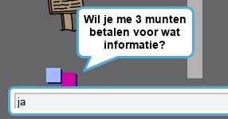
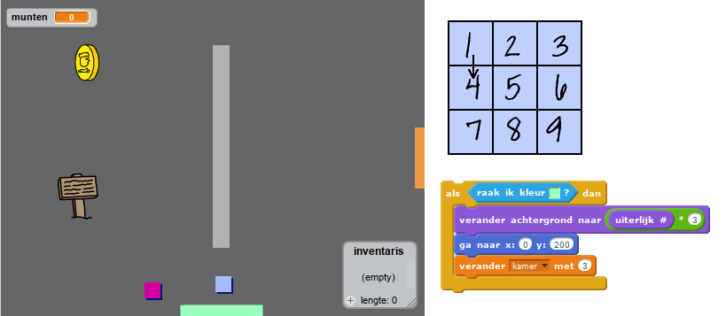

--- challenge ---

## Uitdaging: vergroot je wereld

Je kunt nu doorgaan met het maken van je eigen wereld! Hier zijn wat ideeën:

+ Verander de spelomgeving en verander spelafbeeldingen
+ Voeg geluid en muziek toe aan je spel
+ Voeg meer mensen, vijanden, borden en munten toe
+ Voeg rode en gele deuren toe en bijzondere sleutels om ze te openen
+ Voeg meer kamers toe aan je wereld
+ Voeg andere nuttige dingen toe aan je spel

+ Gebruik munten om informatie van andere personen te krijgen:

+ Je zou zelfs deuren kunnen toevoegen aan de noord- en zuidwanden van kamer 1, zodat de speler in alle vier de richtingen door kamers kan lopen. Als je bijvoorbeeld negen kamers hebt, zou je die kunnen zien als een raster van 3 × 3. Je kunt dan `3` optellen bij het kamernummer om naar een ​​niveau lager te gaan.

--- /challenge ---
***
### Door de community geleverde vertaling 

Dit project werd vertaald door **Henny van Ham** en gecontroleerd door **Cor Groot**. 

 Onze geweldige vertalers helpen ons om kinderen over de hele wereld de kans te geven te leren coderen. Jij kunt ons helpen nog meer kinderen te bereiken door onze projecten te vertalen - lees meer op [rpf.io/translators](https://rpf.io/translators).
