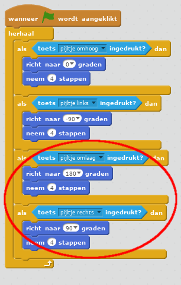

## De sprite van de `speler` verplaatsen

Laten we beginnen met het maken van een sprite voor de `speler` die zich in jouw wereld kan bewegen.

+ Als je Scratch online gebruikt, open je het Scratch-project 'Maak je eigen wereld' op [http://jumpto.cc/world-go](https://scratch.mit.edu/projects/235588207/#editor){:target="_blank"}. Als je Scratch offline gebruikt, downloadt je hier het project [http://jumpto.cc/world-get](https://github.com/raspberrypilearning/create-your-own-world-scratch2/raw/master/nl-NL/resources/CreateYourOwnWorldResources.sb2){:target="_blank"}, en open je het met behulp van de offline editor. 


De persoon die het spel speelt, gebruikt de pijltjestoetsen om de `speler` te verplaatsen. Als de persoon op de pijl omhoog drukt, moet je de sprite van de `speler` vertellen omhoog te bewegen, zodat het in de juiste richting gaat.

+ Voeg deze code toe aan de sprite `speler`:

```blocks
    wanneer groene vlag wordt aangeklikt
herhaal 
  als <toets [pijltje omhoog v] ingedrukt? > dan 
    richt naar (0) graden
    neem (4) stappen
  end
end
```

+ Test sprite `speler` door op de vlag te klikken en vervolgens de pijl omhoog ingedrukt te houden. Is de sprite `speler`omhoog gaan?
    
    

+ Om de sprite `speler` naar links te verplaatsen moet je er nog een `if`{:class="blockcontrol"} -blok met vergelijkbare code aan toevoegen:

```blocks
    wanneer groene vlag wordt aangeklikt
    herhaal
        als <toets[pijltje omhoog v] ingedrukt? > dan
            richt naar (0) graden
            neem (4) stappen
        end
        als <toets [pijltje links v] ingedrukt? > dan
            richt naar (-90) graden
            neem (4) stappen
        end
    end
```

+ Voeg meer code toe aan de sprite `speler`zodat die ook nog naar beneden en naar rechts kan gaan. Gebruik als hulp de code die je al hebt.

--- hints --- --- hint --- Om naar boven te gaan richtte je de sprite `speler` naar de richting `0` graden. Wat zou je moeten doen om de sprite naar beneden te verplaatsen?

Om naar links te gaan, richtte je de sprite naar de richting `-90` graden. Wat zou je moeten doen om de sprite naar rechts te verplaatsen? --- /hint --- --- hint --- Je moet deze twee blokken veranderen:

```blocks
<toets [ v] ingedrukt?>&lt;key [ v] pressed&gt;
```

```blocks
richt naar () graden
```

Kopieer de code die je hebt gebruikt om omhoog te gaan, maar wijzig deze twee blokken om de sprite `speler` naar beneden te laten gaan. Doe hetzelfde om naar rechts te gaan. --- /hint --- --- hint --- Zo zou de code eruit moeten zien:

 --- /hint --- --- /hints ---
