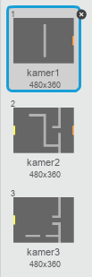
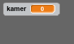
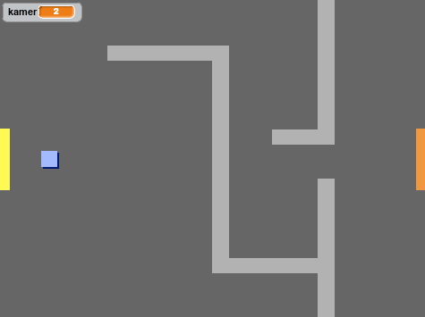

## Programmeer je wereld

Laten we de sprite `speler` toestaan om door deuren naar andere kamers te lopen.

Het project bevat achtergronden voor extra kamers:



+ Maak een nieuwe variabele 'voor alle sprites' met de naam `kamer`{:class="blockdata"} om bij te houden in welke kamer de `speler` sprite zich bevindt.

[[[generic-scratch-add-variable]]]



+ Als de sprite `speler` de oranje deur in de eerste kamer raakt moet de volgende achtergrond worden weergegeven en de sprite `speler` moet teruggaan naar de linkerkant van het speelveld. Voeg deze code toe binnen de `herhaal`{:class="blockcontrol"} lus van de sprite `speler`:

```blocks
    als <raak ik kleur [#F2A24A]?> dan 
  verander achtergrond naar [volgende achtergrond v]
  ga naar x: (-200) y: (0)
  verander [kamer v] met (1)
end
```

+ Voeg deze code toe aan het **begin** van de code van de sprite `speler ` (boven de `herhaal`{:class="blockcontrol"} lus) om ervoor te zorgen dat alles wordt gereset wanneer op de vlag wordt geklikt:
    
    ```blocks
        maak [kamer v] (1)
    ga naar x: (-200) y: (0)
    verander achtergrond naar [kamer v]
    ```

+ Klik op de vlag en verplaats de sprite `speler`door de oranje deur. Gaat de sprite naar het volgende scherm? Verandert de variabele `kamer`{:class="blockdata"} naar `2`?



--- challenge ---

### Uitdaging: naar de vorige kamer gaan

+ Kun je de sprite `speler` door een gele deur naar de vorige kamer laten gaan? De code die je hiervoor nodig hebt lijkt erg op de code die je al hebt gemaakt om naar de volgende ruimte te gaan.

--- /challenge ---