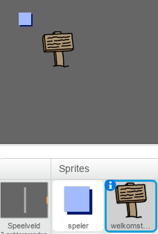
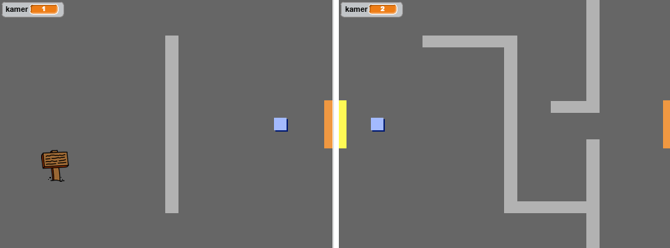
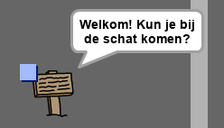

## Borden

Laten we borden aan je wereld toevoegen om de speler op zijn reis te begeleiden.

+ Je project bevat een sprite `welkomstbord`:



+ De sprite `welkomstbord` zou alleen zichtbaar moeten zijn in kamer 1, dus voeg code toe aan de sprite `welkomstbord` zodat dat gebeurt:

```blocks
    wanneer groene vlag wordt aangeklikt
herhaal 
  als <(kamer) = [1]> dan 
    verschijn
  anders
    verdwijn
  end
end
```

+ Test de sprite `welkomstbord` door van kamers te wisselen. Het bord mag alleen zichtbaar zijn in kamer 1.
    
    

+ Een bord is niks als er niet iets op staat! Voeg code toe om een bericht weer te geven als de sprite `welkomstbord` wordt aangeraakt door de sprite `speler`:

```blocks
    wanneer groene vlag wordt aangeklikt
herhaal 
  als <(kamer) = [1]> dan 
    verschijn
  anders
    verdwijn
  end
  als <raak ik [speler v]? > dan 
    zeg [Welkom! Kun je bij de schat komen?]
  anders
    zeg []
  end
end
```

+ Probeer de sprite `welkomstbord` uit - je zou nu een bericht moeten zien als de sprite `speler` er tegenaan komt.

