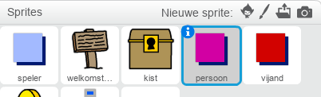

## Personen

Laten we andere personen aan je wereld toevoegen waarmee de sprite `speler` kan communiceren.

+ Schakel over naar de `persoon` sprite.



+ Voeg een code toe aan de sprite `persoon` zodat die praat met de sprite `speler`. Deze code zal erg lijken op de code die je aan je sprite `welkomstbord` hebt gegeven:

```blocks
    wanneer groene vlag wordt aangeklikt
ga naar x: (0) y: (-150)
herhaal 
  als <raak ik [speler v]? > dan 
    zeg [Wist je dat je door de oranje en gele deuren kunt gaan?]
  anders
    zeg []
  end
end
```

+ Je kunt de sprite `persoon` ook laten bewegen door deze twee blokken toe te voegen in de `anders`{:class="blockcontrol"} sectie van je code:

```blocks
neem (1) stappen
keer om aan de rand
```

De sprite `persoon` zal nu gaan bewegen maar stopt om te spreken met sprite `speler`.


--- challenge ---

### Uitdaging: verbeter de persoon

Kun je code toevoegen aan de sprite `persoon` zodat die alleen in kamer 1 verschijnt? Zorg ervoor dat je je code test.

--- /challenge ---