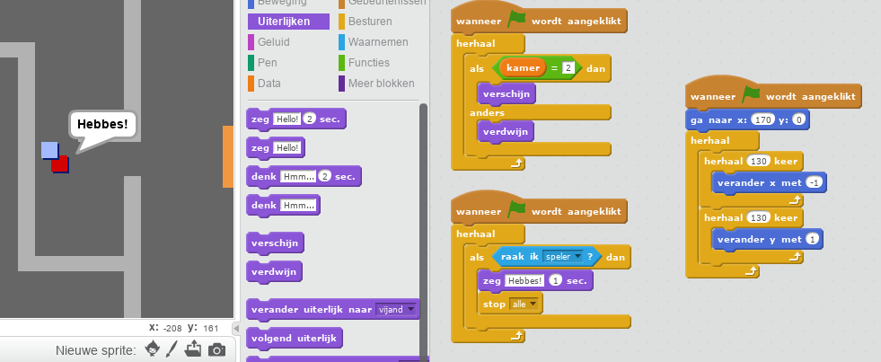

--- challenge ---

## Uitdaging: voeg een vijand toe

Je zou ook rondlopende vijanden kunnen toevoegen. Als de speler een vijand aanraakt stopt het spel.

+ Voeg code toe aan de sprite `vijand` zodat die alleen in kamer 2 verschijnt.

+ Voeg code toe om de sprite `vijand` te laten bewegen en om het spel te stoppen als sprite `vijand` de sprite `speler` aanraakt. Het is makkelijker om dat in verschillende blokken code te doen. Zo zou sprite `vijand` eruit kunnen zien:

+ + die alleen in kamer 2 te zien is
    + die rondloopt in de kamer
    + het spel eindigt als de sprite `speler` hem aanraakt

--- /challenge ---

--- challenge ---

## Uitdaging: meer vijanden

Kun je nog een sprite `vijand` maken in kamer 3 die op en neer beweegt door het gat in de muur?

--- /challenge ---